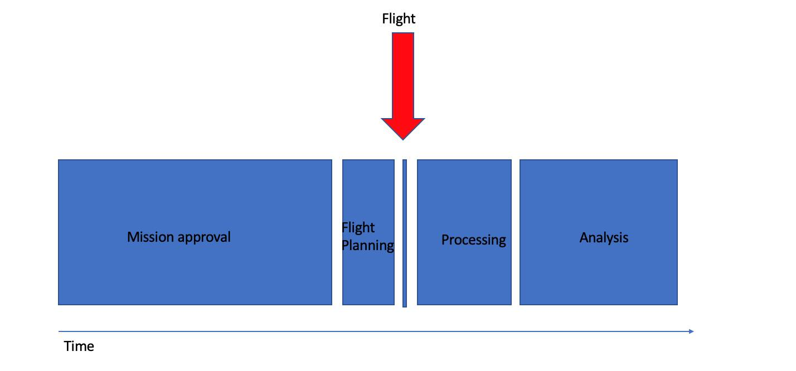

# Autorisations

Le vol de drone est soumis à des réglementation nationales voire locales. Avant d'entamer concrètement toute mission, il est indispensable de se renseigner sur la législation.

Il peut être nécessaire de faire des demandes d'autorisation de vols. Il est important de conserver précieusement les papiers relatifs au drone : 
- Facture d'achat
- Modèle précis
- Immatriculation (si applicable)
- Papiers import/export par les douanes
- Historique des réparations par le constructeur

<figure align="center">
    
    <figcaption>Répartition du temps conseillée entre les différentes étapes <a href="https://uav-guidelines.openaerialmap.org/pages/07-preparing-for-the-uav-mission/">(source)</a></figcaption>
</figure>