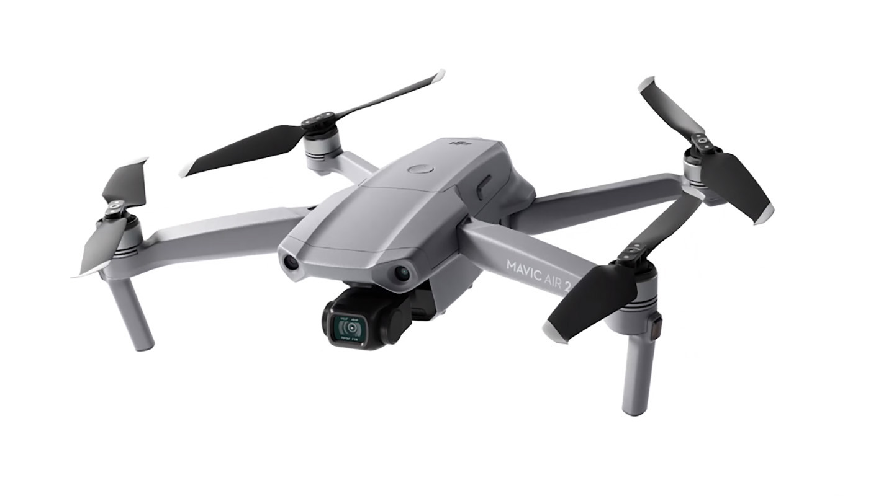

# Contraintes matérielles

## Drone

Le drone de [Mitsio Motu](https://www.mitsiomotu.com/) est le [Mavic Air 2](https://www.dji.com/mavic-air-2/specs). C'est un très bon drone amateur. Il embarque un appareil photos/caméra et une balise GPS/GLONNASS.

<figure align="center">
    
    <figcaption>Drone Mavic Air 2</figcaption>
</figure>

Voici les contraintes à prendre en compte avec ce drone : 
- 3 batteries de 20 à 25 minutes d'autonomie
- Appareil photo 12MP (3000x4000 px) ou 48MP (6000x8000 px)
- Pas de capteur hors RGB
- Prise d'images en PNG et DNG (format RAW de DJI)
- Pas de planification de vol prévue par le constructeur (contrainte contournée)
- Papiers relatifs au drone et à son import au Togo égarés
- Stockage de 8Go embarqué sur le drone + une carde micro SD de 128Go

## Ordinateur

La phase de reconstruction dans un modèle 3D demande de la puissance de calcul. Le tableau ci-dessous est extrait de la [documentation de ODM](https://docs.opendronemap.org/installation/#id4) (logiciel que nous utilisons pour la reconstruction) et présente les recommendation de hardware à avoir en fonction du nombre d'images.

| Number of images | RAM of RAM + Swap |
| ---------------: | ----------------: |
| 40               | 4                 |
| 250              | 16                |
| 500              | 32                |
| 1500             | 64                |
| 2500             | 128               |
| 3500             | 192               |
| 5000             | 256               |

Un projet de la taille de celui du festival de la paix requiert par enxemble environ 2500 images. Aucun ordinateur de l'entreprise n'a 128Go de RAM. Plusieurs solutions sont possibles pour contourner ce problèmes : 
1. Reconstruire le bâtiment par section et faire du recalage ensuite
2. Allouer un très grand [swap](https://fr.wikipedia.org/wiki/Espace_d%27%C3%A9change) et traiter la totalité en une seule fois

