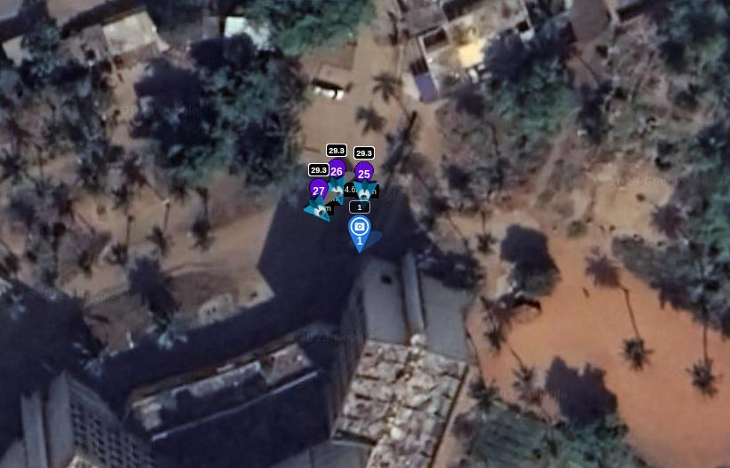

# Conversion du format avec Carto3D

[**Dépôt Github du projet**](https://github.com/mitsio-motu-data/Carto3D)

<figure align="center">
    
    <figcaption>Image issue de **Carto3D**</figcaption>
</figure>

Cette étape a plusieurs intérêts : 
- Ouvrir une mission au format de Mission Planner (**.waypoints**) ou de Litchi (**.csv**).
- *[Optionnel]* Conversion au format de Litchi si une mission Mission Planner est ouverte.
- *[Optionnel]* Convertir la mission en un vol vertical pour l'acquisition d'un façade.
- *[Optionnel]* Mettre à jour l'altitude et la vitesse du vol.
- Définir une liste d'actions à chaque *waypoint* :
    - Attendre 0.5 seconde.
    - Prendre une photo.
    - Attendre 0.5 seconde.

L'installation et l'utilisation de **Carto3D** sont détaillées sur le [**Dépôt Github du projet**](https://github.com/mitsio-motu-data/Carto3D).

Comme expliqué dans [Planification de la mission](planification.md),  certaines missions sont plus adaptées à planifier sur Litchi que Mission Planner. Elles peuvent être exportées de Litchi en format CSV et utilisées également dans [**Carto3D**](https://github.com/mitsio-motu-data/Carto3D).

<figure align="center">
    
    <figcaption>Exemple de mission (angle) plus adaptée à planifier sur Litchi</figcaption>
</figure>
