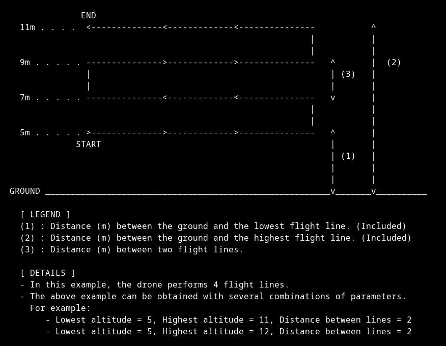

# Conversion du format avec Carto3D

[**Dépôt Github du projet**](https://github.com/mitsio-motu-data/Carto3D)

<figure align="center">
    
</figure>

Cette étape a plusieurs intérêts : 
- Ouvrir une mission au format de Mission Planner (**.waypoints**) ou de Litchi (**.csv**).
- *[Optionnel]* Conversion au format de Litchi si une mission Mission Planner est ouverte.
- *[Optionnel]* Convertir la mission en un vol vertical pour l'acquisition d'un façade.
- *[Optionnel]* Mettre à jour l'altitude et la vitesse du vol.
- Définir une liste d'actions à chaque *waypoint* :
    - Attendre 0.5 seconde.
    - Prendre une photo.
    - Attendre 0.5 seconde.

L'installation et l'utilisation de **Carto3D** sont détaillées sur le [**Dépôt Github du projet**](https://github.com/mitsio-motu-data/Carto3D).

## Distance entre les lignes pour une mission verticale

Dans le cas d'une mission verticale, il faut faire attention à la distance entre les lignes (*flight lines*) pour conserver le recouvrement que l'on souhaite. La distance entre les *waypoints* est déjà bonne car ils ont été générés avec *Mission Planner* en connaissant les contraites de caméra et de recouvrement. Cependant, il faut renseigner à **Carto3D** la bonne distance entre les lignes pour converver un *Sidelap* correct.

<figure align="center">
    
    <figcaption>Scéma issu de Carto3D illustrant les <em>flight lines</em></figcaption>
</figure>

 Ci-dessous, un tableau présentant la distance entre les lignes de vol pour avoir un recouvrement *Sidelap* de **80%** en fonction de la distance à la surface et du drone utilisé :

| Distance à la surface (m) | Mavic Air 2 (m) | Mavic Pro 2 (m) | Phantom 4 (m) |
| :-----------------------: | :-------------: | :-------------: | :-----------: |
| 8                         | 2.28            | 2.07            | 2.42          |
| 9                         | 2.56            | 2.33            | 2.72          |
| 10                        | 2.84            | 2.58            | 3.02          |
| 11                        | 3.13            | 2.84            | 3.33          |
| 12                        | 3.41            | 3.10            | 3.63          |
| 13                        | 3.7             | 3.36            | 3.93          |
| 14                        | 3.98            | 3.62            | 4.23          |
| 15                        | 4.27            | 3.88            | 4.54          |
| 16                        | 4.55            | 4.14            | 4.84          |
| 17                        | 4.84            | 4.39            | 5.14          |
| 18                        | 5.12            | 4.65            | 5.44          |
| 19                        | 5.4             | 4.91            | 5.75          |
| 20                        | 5.69            | 5.17            | 6.05          |

Si jamais vous vous trouvez dans une situation qui n'est pas représentée dans ce tableau, vous pouvez trouver l'information grâce à Mission Planner : 
1. Dessinez un polygone et créez une nouvelle `Survey Grid`.
2. Sélectionnez la caméra pour votre modèle de drone.
3. Réglez l'altitude à la distance à la surface que vous souhaitez.
4. Rendez-vous dans `Camera Options` et réglez le recouvrement que vous souhaitez (`Overlap` pour la distance entre les points et `Sidelap` pour la distance entre les lignes).
5. Lisez et reportez dans ce tableau la valeur de distance entre les lignes. Vous avez votre information.
