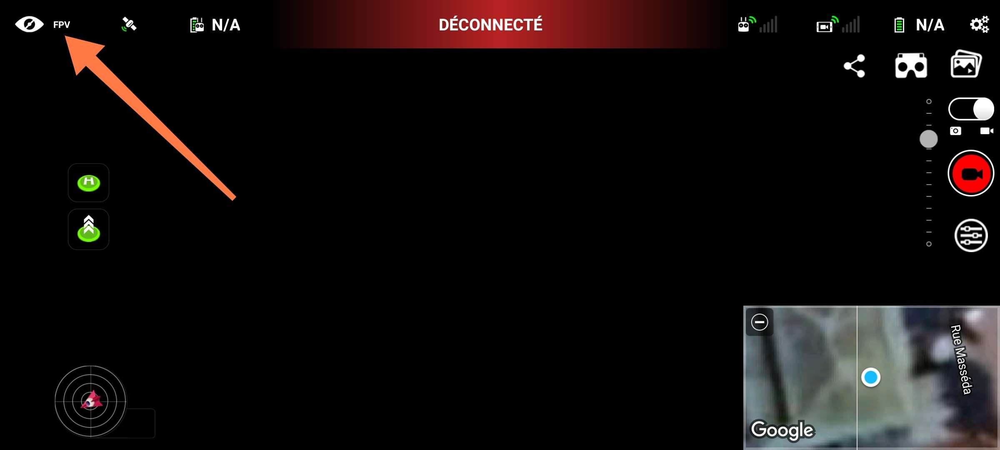
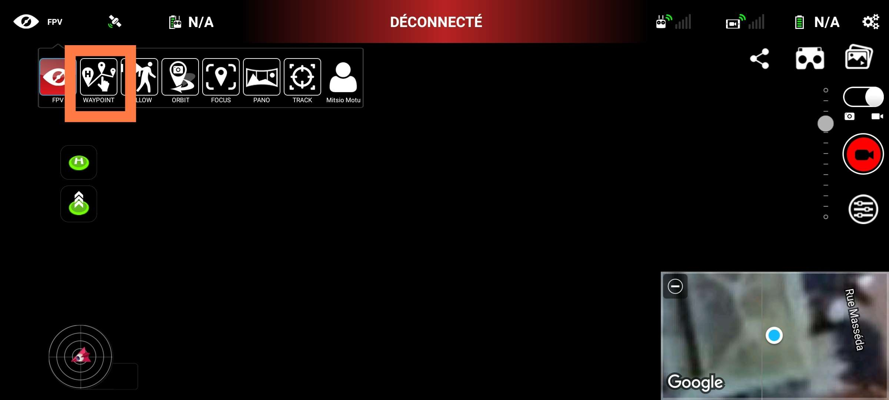
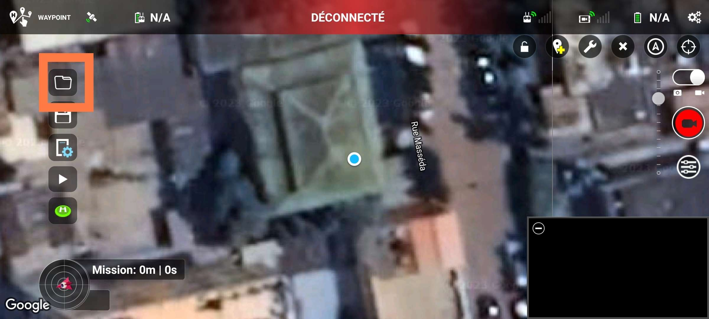

# Importation sur Litchi Fly

- [**Site de Litchi Fly**](https://flylitchi.com/)
- [**Guide pour l'utilisateur**](https://flylitchi.com/help#missionhub)

> 💪 La planification touche à sa fin, plus que quelques étapes, courage !

## Mission Hub

Une fois sur le site de Litchi Fly, rendez-vous sur [Mission Hub](https://flylitchi.com/hub).

<figure align="center">
    
    <figcaption>Accueil du site Litchi Fly</figcaption>
</figure>

Une fois dans le **Mission Hub**, sélectionnez `MISSIONS > New`.
Importons maintenant la mission avec `MISSIONS > Import`.
Sélectionnez le *.csv* de la mission.

Vous pouvez cliquer sur quelques points de la mission pour vérifier que tout vous semble correct (altitude et vitesse par exemple) et vérifier que les trois actions (attendre, prendre un photo, attendre) ont bien été paramétrées.

Il reste à voir les paramètres généraux de la mission dans `SETTINGS`.

| Paramètre | Explication       | Pour un vol horizontal | Pour un vol vertical   |
| :-------: | ----------------- | ---------------------- | ---------------------- |
| Units     | Unités de mesure |
| Heading Mode |<ul><li><b>TNW</b> : Heading qui pointe en direction du prochain waypoint.</li><li><b>ID</b> : Heading lors du départ conservé.</li><li><b>UC</b> : Contrôle du heading pendant la mission avec le joystick gauche.</li><li><b>WD</b> : Utilisation du heading défini aux waypoints dans Litchi.</li></ul> [Doc Litchi](https://flylitchi.com/help#waypoints-p3) | Auto (TNW) | <ul><li>Façade : Initial(ID)</li><li>Angle : Custom(WD)</li></ul> |
| Finish Action | **RTH** signifie *Return To Home*, *HOME* étant le point de départ, qui se défini automatiquement au lancement du drone. Les autres options ont un nom explicite. Le drone montera en haute altitude avant d'effectuer un **RTH** pour ne rien heuter.    Les noms des autres options sont explicites. | RTH | RTH |
| Path Mode | Permet d'arrondir les angles du chemin de la mission. Utilisé pour les vols esthétiques. | Straight Lines | Straight Lines |
| Cruising speed | Titre explicite. | 11km/s | 11km/s |
| Max Flight speed | Titre explicite. | 15km/s | 15km/s |
| Photo Capture Interval | Cela permet de prendre une photo toutes les *x* secondes ou tous les *y* mètres. Peut être désactivé en renseignant *0*. Nous n'en avons pas besoin car les photos sont déjà prises à nos *waypoints*. | 0 (Disabled) | 0 (Disabled) |
| Default Curve Size | Permet de paramétrer la courbe si *Path Mode* est *Curved Turns* | | |
| Default Gimbal Pitch Mode | | None | None |
| Show Discover Missions | | No | No |
| Use Online Elevation | Pour chaque *waypoint*, un paramètre `Above Ground` peut être activé. Quand il est activé, Litchi a besoin de données d'élévation du sol pour que l'altitude du drone à chaque waypoint soit relative au sol sous ce waypoint. Il est possible d'importer des données d'élévation ou d'utiliser les données de Litchi en cochant cette option. En ne cochant ni `Above Ground` ni `Use Online Elevation`, l'altitude du vol sera relative au point de départ, parfait pour les zones assez plates. [Doc Litchi](https://flylitchi.com/help#missionhub)| No | No |

Une fois tout cela fait, plus qu'à sauvegarder ! Pour cela, rendez vous dans `MISSIONS > Save...` et nommez votre mission. Rappelez vous de bien utiliser la nomenclature définie, comme expliqué dans la section [Planification de la mission](planification.md). Vos modifications ne sont pas enregistrées en temps réel. Alors si vous modifiez la mission, pensez bien à la sauvegarder avec la même procédure. En conservant le même nom de mission, les modifications seront enregistrées sans créer de nouvelle mission.

## Application Mobile

[Lien sur Google Play](https://play.google.com/store/apps/details?id=com.aryuthere.visionplus&utm_source=global_co&utm_medium=prtnr&utm_content=Mar2515&utm_campaign=PartBadge&pcampaignid=MKT-Other-global-all-co-prtnr-py-PartBadge-Mar2515-1)

[Lien sur l'App Store](https://apps.apple.com/app/id1059218666?mt=8&uo=4)

> Tutoriel écrit avec la version mobile 4.26.2-g Android de Litchi Fly.
> ⚠️ Attention, l'application ne peut être installée que sur 3 appareils simultanément.

Les missions sont automatiquement synchronisées et sont tout de suite accessibles depuis l'application mobile.
Pour y accéder, commencez par télécharger l'application et l'ouvrir.

Il faut commencer par changer de mode de pilotage.
Quand l'application s'ouvre, elle est par défaut en **FPV** (First Person Viewer).
Nous souhaitons passer en mode **Waypoint**.
Pour cela, cliquez dans l'icône **FPV** en haut à gauche de l'écran.

<figure align="center">
    
    
</figure>

Vous pouvez voir et charger vos missions depuis l'icône de dossier.

<figure align="center">
    
</figure>

🏁 Et voilà, c'est parti pour la réalisation du vol !
