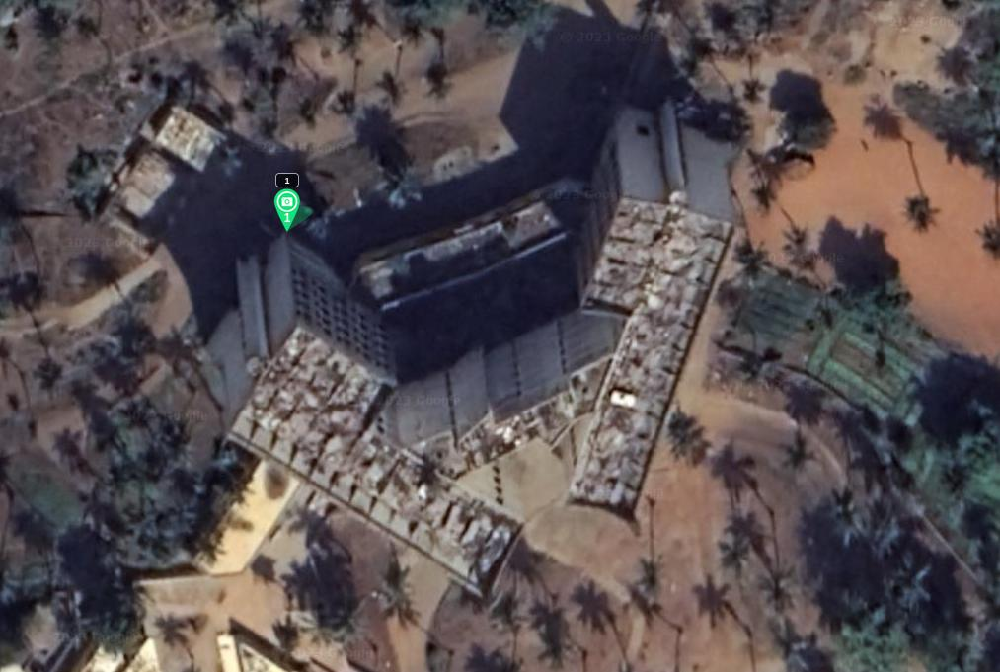

# Grille pour les angles avec Litchi Fly

- [**Site de Litchi Fly**](https://flylitchi.com/)
- [**Guide pour l'utilisateur**](https://flylitchi.com/help#missionhub)

> Dans certaines configurations, il faut utiliser Litchi Fly pour générer la grille de vol. Ceci est le cas pour les angles par exemple. En effet, il s'agit de vol vertical mais pas sur un seul axe comme pour les murs. Nous ne pouvons donc pas utiliser Mission Planner pour cela. De plus, Litchi Fly comprend des options qui vont nous aider dans cette situation.
> Cependant, ces vols peuvent aussi être faits à la main assez facilement. Il faut dans ce cas faire très attention au recouvrement. Nous vous conseillons de prévoir les missions d'angles planifiées pour vous laisser le choix sur le terrain de la méthode à utiliser.

Pour rappel, acquérir les angles est important pour pouvoir faire le lien entre les différentes façades lors de la reconstruction.

## Mission Hub

Une fois sur le site de Litchi Fly, rendez-vous sur `Mission Hub` ou directement sur ce [lien](https://flylitchi.com/hub).

<figure align="center">
    
    <figcaption>Accueil du site Litchi Fly</figcaption>
</figure>

Une fois dans le **Mission Hub**, sélectionnez `MISSIONS > New`. Placez vous là ou vous voulez réaliser votre mission. Nous choisissons de réaliser la mission pour l'angle sous la ligne bleue :

<figure align="center">
    
    <figcaption>Angle pour lequel nous allons réaliser une mission</figcaption>
</figure>

Commencez par placer un `POI` (Point of interest ou Point d'intérêt) en faisant un clic droit au niveau de votre angle. Litchi FLy ouvre alors un petit encadré pour modifier la position et l'altitude de ce POI. Son altitude n'a pas d'importance.

<figure align="center">
    
    <figcaption>Positionnement de notre point d'intérêt</figcaption>
</figure>

Placez ensuite plusieurs *waypoints* (clic gauche) comme illustré ci-dessous. Faites attention à ce que ces points soient assez rapprochés. Ici aucun calcul n'est fait pour vérifier que les images auront assez de recouvrement entre elles. Il vaut mieux qu'elle en aient trop que pas assez.

<figure align="center">
    
    <figcaption>Positionnement des waypoints</figcaption>
</figure>

Nous souhaitons que la caméra soit pointée en direction de l'angle, quelle que soit la position du drone dans cette mission. Pour cela, il faut se rendre dans `SETTINGS` > `Heading Mode` et activer l'option `Custom (WD)` si ce n'était pas déjà le cas. Le *heading* pointera alors vers le POI le plus proche.

> Il ne vous reste plus qu'à exporter la mission en format CSV et rendre verticale cette mission grâce à [Conversion du format avec Carto3D](carto3d.md) en suivant la même logique qu'une mission verticale venant de Mission Planner.

