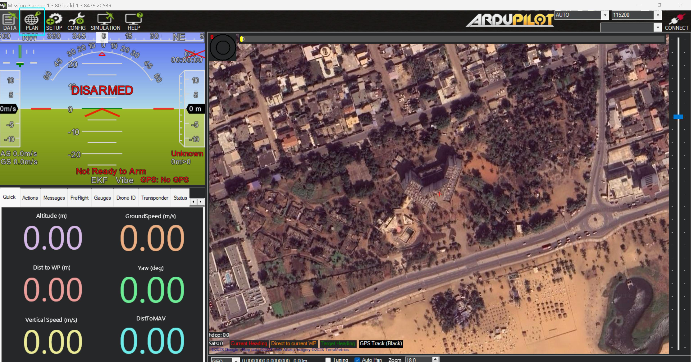
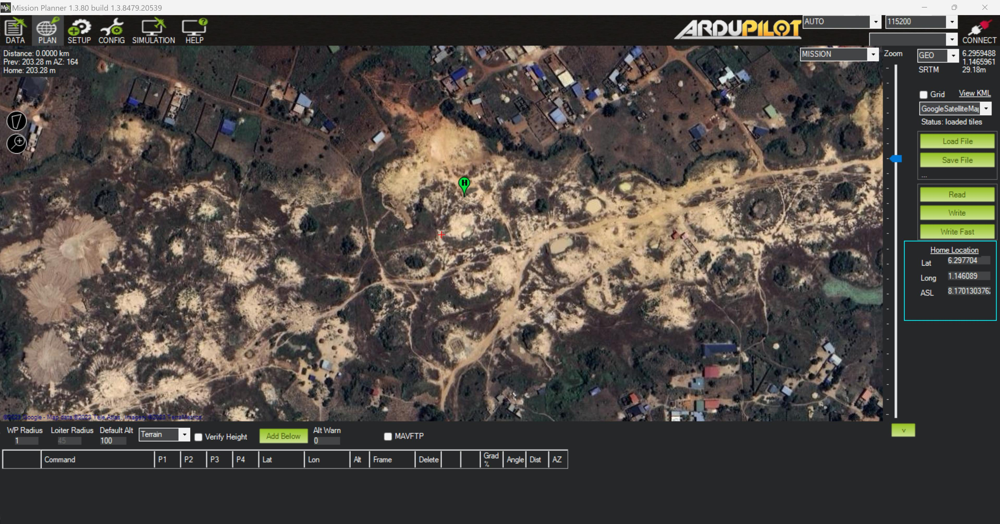
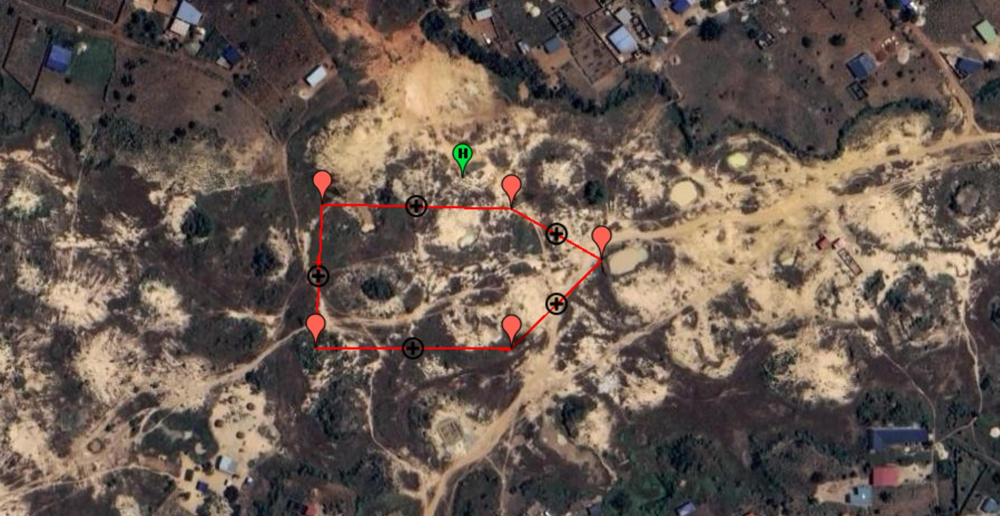
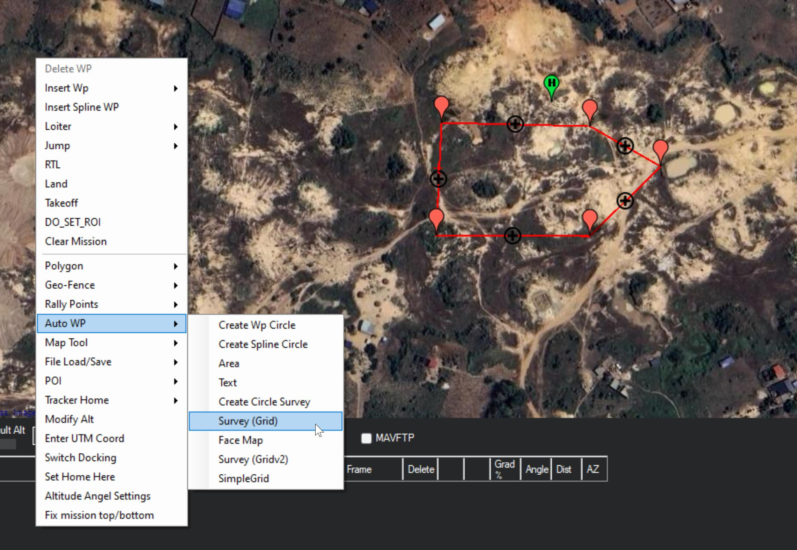
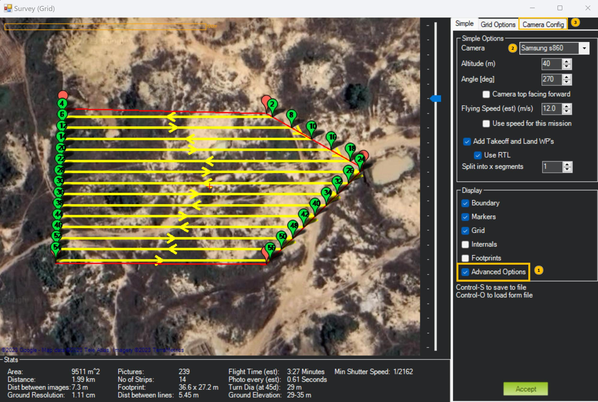
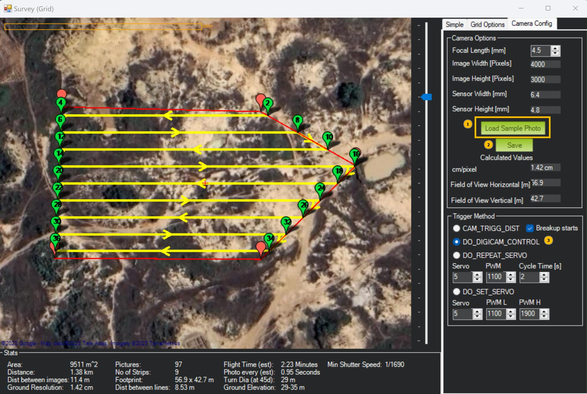
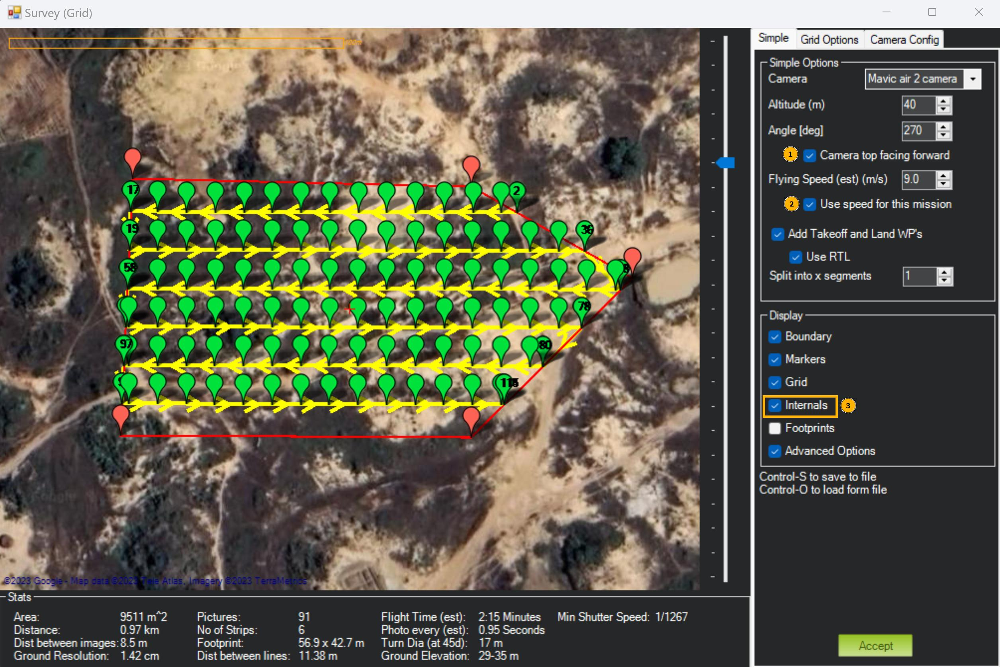
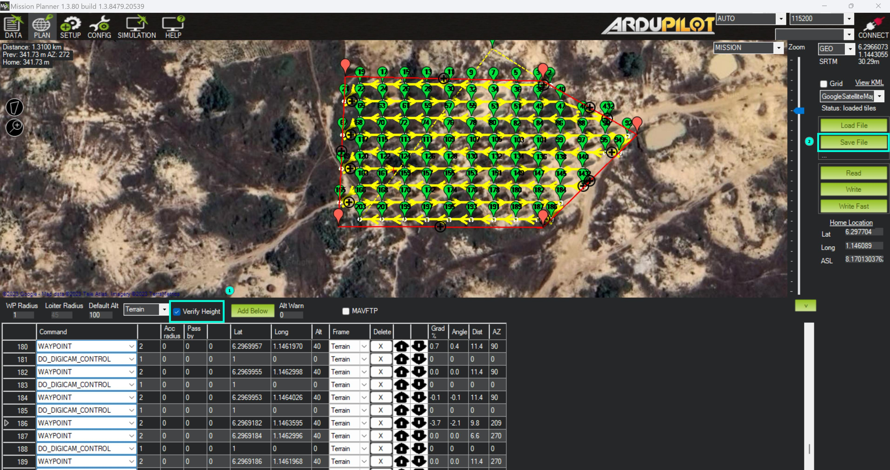

# Grille de survol avec Mission Planner

[**Site de Mission Planner**](https://ardupilot.org/planner/)

> Tutoriel écrit avec la version **1.3.8479.20539** de Mission Planner

Réaliser un vol d'acquisition est long et fastidieux. De plus, les images de la zone acquise doivent être prises avec un recouvrement spécifique. Utiliser un logiciel qui planifie les missions permet de s'assurer que la prise d'images sera bonne et permet que l'opérateur drone réalise la mission plus facilement. Pour faire cela, nous utilisons [Mission Planner](https://ardupilot.org/planner/). C'est un logiciel gratuit et Open Source qui permet de prévoir des grilles de vol autonome.

Nous appelerons **mission horizontale** un vol sur un plan parrallèle au sol (par exemple pour cartographier un parc) et **mission verticale** un vol sur un plan perpendiculaire au sol (par exemple pour cartographier une façade de bâtiment).

> 🚨 Soyez prévenu, Mission Planner est un logiciel qui présente de nombreux bugs.
> Nous allons essayer de vous guider au mieux dans le logiciel. Il est possible qu'avec
> de nouvelles mises à jour, certains soient résolus et que d'autres apparaissent.

## Installation

Commencez par installer Mission Planner en suivant les instructions de ce [lien](https://ardupilot.org/planner/docs/mission-planner-installation.html).

## Ouverture de Mission Planner et *Home*
En ouvrant Mission Planner, vous arriverez sur un écran similaire. Rendez-vous dans la section **PLAN**, accessible par le boutton encadré en bleu. 

<figure align="center">
    
    <figcaption>Écran d'accueil de Mission Planner</figcaption>
</figure>

Placez le point de départ et d'arrivée (*Home*) : 
- Soit à la main : `Clic droit` > `Set home here`
- Soit avec les coordonnées GPS : en bas du panneau de droite (voir photo ci-dessous)

L'idéal est de placer ce point vers la zone de la mission mais sa position n'a pas de véritable importance car il ne sera en fait pas utilisé dans nos mission. Le placer permet cependant de travailler plus facilement avec Mission Planner qui veut qu'un point *Home* soit défini. 

<figure align="center">
    
    <figcaption>Définition d'un point <em>Home</em></figcaption>
</figure>

## Mission horizontale

Créez un polygon représentant la zone que le drone doit couvrir. `Clic droit` > `Polygon` > `Draw a Polygon` (ou `Load Polygon` pour importer un fichier)

<figure align="center">
    
    <figcaption>Création d'un polygone</figcaption>
</figure>

Voici à quoi devrait ressembler votre interface une fois le polygone dessiné :

<figure align="center">
    
    <figcaption>Polygone</figcaption>
</figure>

Il faut ensuite générer le parcours. Pour cela, utilisez la fonction de quadrillage (ou `Survey (Grid)`). `Clic droit` > `Auto WP` > `Survey (Grid)`

<figure align="center">
    
    <figcaption>Chemin vers <em>Survey grid</em></figcaption>
</figure>

Une nouvelle fenêtre apparaît. Elle va permettre de paramétrer le quadrillage pour la grille de survol.
1. Commencez par activer les options avancées. Dans le panneau de droite : `Simple` > `Display` > `Advanced Options` 
2. Vérifiez si le modèle du drone (et donc les paramètres de sa caméra) est connu de Mission Planner. Si c'est le cas sélectionnez le modèle du drone. Si ce n'est pas le cas nous déterminerons les paramètres de la caméra dans les étapes suivantes, **la première fois uniquement**.

    Dans le panneau de droite : `Simple` > `Simple Options` > `Camera`
    
    Ce n'est le cas pour le **DJI Mavic Air 2** lors de la rédaction de ce tutoriel.

3. Rendez-vous dans le menu des paramètres de la caméra.
Dans le panneau de droite : `Camera Config`

<figure align="center">
    
</figure>

Les étapes 1 et 2 sont nécessaires seulement si le modèle du drone n'est pas connu de Mission Planner et **la première fois uniquement**.

1. Importez une image capturée par le drone. Cela va permettre à Mission Planner de déterminer automatiquement les paramètres *focal length*, *image width (pxl)* et *image height (pxl)*. ⚠️ Les deux paramètres restants (taille du *sensor*) ne peuvent pas être déterminés par Mission Planner (bien que les champs soient remplis, ce sont les paramètre de la caméra qui était enregistrée par défaut. Il ne sont pas mis à jour). Il faudra vous renseigner sur la nature de votre capteur pour remplir ces champs vous même.

    Dans le panneau de droite : `Camera Config` > `Camera Options` > `Load Sample Photo`

    Ci-dessous, le tableau regroupant tous les paramètres des caméras des drones déjà utilisés ches Mitsio Motu. Merci de mettre à jour ce tableau à chaque nouveau modèle utilisé.

|                        | Mavic Air 2 | Mavic Pro 2 | Phantom 4 |
| :--------------------: | :---------: | :---------: | :-------: |
| **Focal length**       | 4.5         | 10.3        | 8.8       |
| **Image width (px)**   | 4000        | 5472        | 5472      |
| **Image height (px)**  | 3000        | 3648        | 3648      | 
| **Sensor width( mm)**  | 6.4         | 13.31       | 13.31     |
| **Sensor height (mm)** | 4.8         | 8.88        | 8.88      |
| **Proportion**         | 4/3         | 3/1         | 3/1       |
    

2. Vérifiez que les paramètres sont cohérents puis sauvegardez les. Mission Planner va vous demander de renseigner le modèle du drone (autrement dit, son nom). Cela permettra à Mission Planner de l'enregistrer et de vous le proposer dans les drones connus lors de votre prochaine plannification.

    Dans le panneau de droite : `Camera Config` > `Camera Options` > `Save`

3. Sélectionnez le mode de capture d'images `DO_DIGICAM_CONTROL`. Ce mode permet de préciser combien de temps le drone doit s'arrêter au moment de prendre la photo (afin de s'assurer que l'image soit nette). 

    Dans le panneau de droite : `Camera Config` > `Trigger Method` > `DO_DIGICAM_CONTROL`

<figure align="center">
    
</figure>

Vous pouvez maintenant renseigner l'ensemble de vos paramètres de vol dans le menu `Grid Options`. Il faut notamment faire attention à : 

- `Camera Options` > `Overlap` et `Sidelap`, les recouvrements de vos images dans le sens de vol et sur les côtés.[^recouv]
- `Camera Options` > `Cross Grid`, qui peut être très utile dans l'acquisition de zones générales avec des bâtiments.[^cross-grid] 
- `Copter Options` > `Delay at WP (sec)`, le temps d'arrêt à chaque point. Il n'est pas nécessaire d'y régler le temps, nous le paramétrerons dans la section [Conversion du format avec Carto3D](carto3d.md).

Enfin, retournez dans le menu `Simple` pour activer 3 options : 

1. `Simple Options` > `Camera top facing forward` : Quand elle est activée, cela signifie que la caméra pointe bien vers l'avant du drone. Cela est nécessaire pour le calcul de la positions des *waypoints*.
2. `Simple Options` > `Use speed for this mission` : Vous pouvez d'ailleurs mettre la vitesse à jour de la mission ici.
3. `Display` > `Internals`

Vérifiez que les points semblent cohérents. Une fois satisfait, cliquez sur `Accept`.

<figure align="center">
    
</figure>

La fenêtre `Survez (Gris)` se ferme et tous les points apparaissent de le plan de vol.

Vous y êtes presque ! 

1. Activez l'option `Verify Height` pour que Mission Planner vérifie les altitudes renseignées s'il a des données disponibles pour la région en question.
2. Exportez les points. Ils sont enregistrés au format `.waypoints` que vous pouvez ouvrir avec un éditeur de texte.

<figure align="center">
    
</figure>

> 👏 Et voilà pour la section Mission Planner ! Il ne reste maintenant plus qu'à convertir et personnaliser la mission
> avec [Conversion du format avec Carto3D](carto3d.md) et enfin à l'importer dans Litchi avec [Importation sur Litchi Fly](litchi.md).

___

[^recouv]: Pour le projet de l'hôtel de la paix, le recouvrement était de 80% pour l'*overlap* et le *sidelap*.

[^cross-grid]: Une *cross-grid* est nécessaire pour l'acquisition complète d'un terrain avec bâtiments par exemple. Pour pouvoir observer les façades, il faut orienter la caméra non pas perpendiculairement au sol mais à 45° par rapport au sol environ. Avec la caméra perpendiculaire, il manquera les façades de bâtiments dans la reconstructiojn. Pour pouvoir obtenir des photos de toutes les zones, il est dans ce cas indispensable de faire un acquisition en cross-grid. Sinon, certaines zones ne pourront pas être reconstituées.