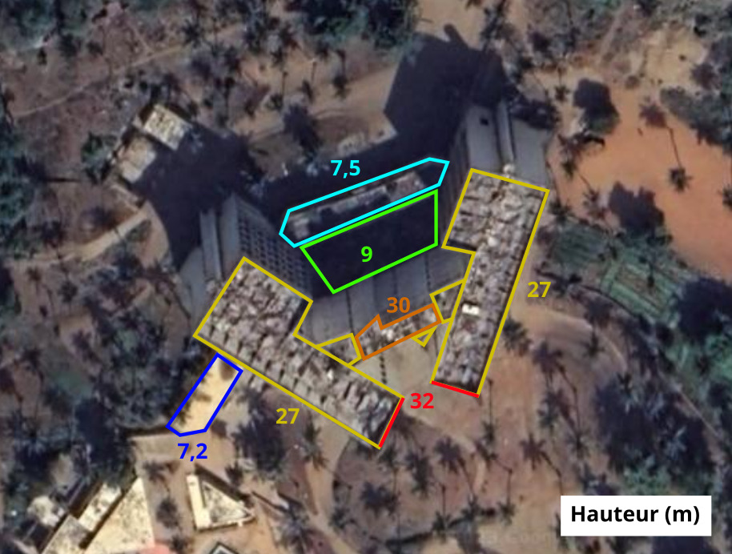
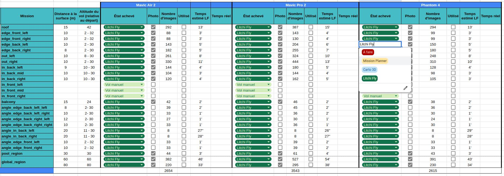
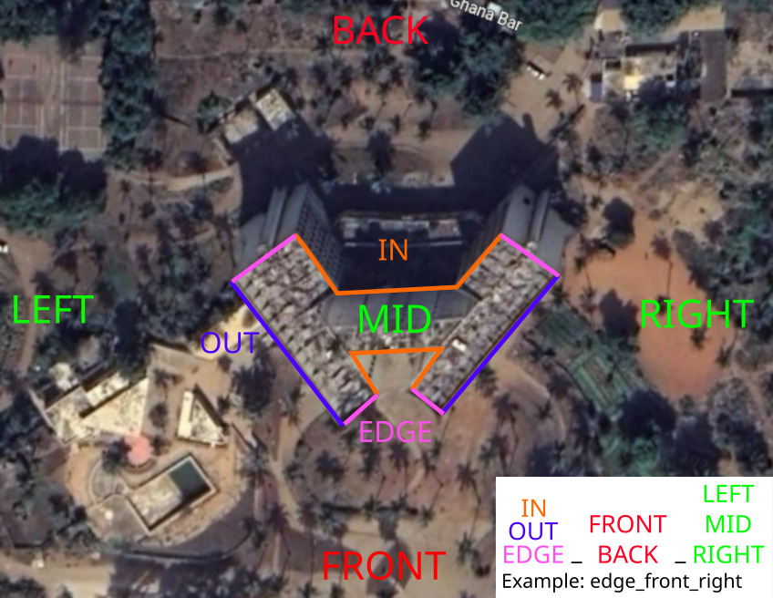

# Planification de la mission

Le drone[**Mavic Air 2**](https://www.dji.com/mavic-air-2/specs) de [DJI](https://www.dji.com/) est normalement destiné à un usage personnel et non professionnel. Il n'inclut pas la possibilité de prévoir des vols autonomes et doit normalement être piloté à la main par l'opérateur. Cependant, il est possible de contourner cela grâce à l'utilisation de différents logiciels que nous allons présenter ici.

Les étapes à suivre pour mettre en place le vol autome sont les suivantes : 

- Prévoir des points GPS à rallier grâce à [**Mission Planner**](mission_planner.md).
- Convertir les points dans le format de **Litchi** et éditer la mission (verticalité par exemple) grâce à [**Carto3D**](carto3d.md).
- Finaliser la mission sur [**Litchi**](litchi.md).

Plus précisément, voici le diagramme complet représentant la file de traitement pour la préparation des missions. Cela permet également de clarifier la place et l'utilité de chaque logiciel dans la file de traitement.

<figure align="center">
    
</figure>

## Quels sont les vols à prévoir ?

> La réponse à cette question dépend évidemment de chaque projet. Nous allons ici considérer qu'il s'agit
> de la cartographie d'un grand bâtiment, comme ça a été le cas pour l'hôtel de la paix. C'est probablement
> une des configurations la plus complexe (par sa grande taille et sa forme biscornue) qui permettra d'aborder de nombreux points.
>
> À vous ensuite d'adapter ces informations à votre projet ! 😉

Pour cartographier un bâtiment de cette taille, il est presque indispensable de planifier les vols pour plusieurs raisons : 
- C'est très fastidieux à la main et une bonne maîtrise de pilotage de drones est nécessaire
- Les images doivent être prises d'une manière très précises (elles soivent avoir un certain pourcentage en commun). Planifier le vol permet que les images soient bien prises. À la main, les erreurs sont trop facile à faire. Les erreurs d'acquisition entravent grandement la qualité de la reconstruction (voire la rendent impossible). Cependant, nous verrons que dans certains cas, les vols ne peuvent s'effectuer qu'à la main.
- Un vol planifié sera souvent plus rapidement effectué sur le terrain qu'à la main. Cela permet donc d'économiser de la batterie.

⚠️ Cependant, il n'est pas possible de planifier une seule très grande mission pour tout le bâtiment. Il faut découper le tout en plusieurs morceaux. Voyons donc maintenant comment sectionner cette mission pour la planifier. Les paramètres conseillés ne sont pas obligatoires. N'hésitez pas à les adapter si vous pensez que c'est nécessaire.

> 📚 Quelques termes et notions avant de commencer !
> - **Vol horizontal** : Vol dont le plan est parallèle au sol. Permet d'acquérir le sol par exemple.
> - **Vol vertical** : Vol dont le plan est perpendiculaire au sol. Permet d'acquérir les façades par exemple.
> - **Caméra à** : 
>    - **0°** : Elle pointe vers le sol
>    - **90°** : Elle est perpendiculaire au sol, elle pointe vers un mur par exemple.
### Le sol

> - Vol horizontal
> - Caméra à 0 ou 45° (45° si des bâtiments sont sur le terrain).
> - Grille simple ou croisée (croisée si des bâtiments sont sur le terrain).
> - Altitude de 20 à 40m environ en fonction de la précision voulue et de la taille du terrain (et donc longueur de la mission et nombre de photos).

Pour acquérir du sol, majoritairement du terrain. En fontion de la précision voulue, le vol peut-être assez bas mais peut monter sans problème jusqu'à 40 voire même 60m ou plus.

La façon la plus simple de le faire est de faire une grille simple. Cependant si des bâtiments sont présents sur le terrain et que vous ne voulez pas perdre les façades, vous pouvez faire une acquisition en grille croisée avec la caméra orientée à 45%. Attention, celle-ci sera beaucoup plus longue et lourde en stockage et traitement.

### Le toît

> - Vol horizontal
> - Caméra à 0 ou 45° (45° si le toît a une forme vraiment compliquée).
> - Grille simple ou croisée (croisée si le toît a une forme vraiment compliquée).
> - Altitude à +/- 15m du toît environ en fonction de la précision voulue.
> - À planifer sur Mission Planner

Dans la majorité des cas, un vol en grille simple avec la caméra à 0° suffira. Attention, l'altitude de vol donnée ici est relative au toît et non pas au sol. Il faudra trouver un moyen de connaître la hauteur maximale du bâtiment cartographié. Vous pouvez estimer sa hauteur grâce à son nombre d'étages ou bien faire un prévol avec le drone pour aller relever les altitudes de la toiture. Pour cela, placez la caméra du drone à 90° et faite le voler jusqu'à ce que le niveau que vous souhaitez mesurer soit au centre de l'image. L'altitude du drone, à ce moment, correspond à la hauteur du toit.

<figure align="center">
    
    <figcaption>Exemple d'un bon rendu de la caméra pour mesurer la hauteur d'un bâtiment </figcaption>
</figure>

Vous pouvez ensuite créer un plan avec les hauteurs de votre bâtiment comme celui-ci par exemple : 

<figure align="center">
    
    <figcaption>Hauteurs du toît et terrasses de l'hôtel de la paix</figcaption>
</figure>

### Les façades

> - Vol vertical
> - Caméra à 90°.
> - Grille simple.
> - Distance de +/- 15m du toît environ en fonction de la précision voulue et du terrain.
> - À planifer sur Mission Planner

Pour chaque façade, il faudra faire une mission différente car la file de traitement prend (pour l'instant) seulement les missions sur une même ligne.

### Les angles

> - Vol vertical
> - Caméra à 90°.
> - Grille simple.
> - Distance de +/- 15m du toît environ en fonction de la précision voulue et du terrain.
> - À planifier sur Litchi Fly

L'acquisition des angles est primordiale pour que le logiciel de reconstruction comprenne le lien entre les façades et puisse tout reconstruire lui même. Il faut que les photos de ces missions couvrent un peu de chaque façade.

### Zone générale

> - Vol horizontal
> - Caméra à 0 ou 45° (45° si des bâtiments sont sur la zone).
> - Grille simple ou croisée (croisée si des bâtiments sont sur la zone).
> - Altitude de +/- 40m environ en fonction de la précision voulue et de la taille du terrain (et donc longueur de la mission et nombre de photos).
> - À planifer sur Mission Planner

Bien que les caractéristiques soient très similaires avec l'acquisition du sol, ce sont deux choses très différentes. Par exemple, pour l'acquisition de l'hôtel de la paix, nous vons fait : 
- Une **acquisition générale** de la zone à 40 et 50 m d'altitude en grille croisée (voir polygone bleu dans l'image ci-dessous) incluant le bâtiment principal et un peu de terrain. Cela permet d'obtenir de l'information générale sur le terrain et d'augmenter la qualité de la reconstruction. De plus, cela permet d'avoir des information (même si moyennement précises) sur tout le bâtiment et donc de s'assurer que le logiciel de reconstruction pourra faire le lien entre les différentes zones du bâtiment.
- Une **acquisition de type sol** sur la zone autour de la piscine. À plus basse altitude, elle permet de se focaliser sur une zone qui nous intéresse et d'avoir une meilleure résolution dans une zone spécifique. Certains petits bâtiments étaient présents dans cette zone. Nous avons fait l'erreur de faire malgré tout une acquisition en grille simple et non croisée. Il nous manque donc un peu des façades de ces bâtiments.

<figure align="center">
    
    <figcaption>Bleu : Acquisition générale - Jaune : Acquisition de sol</figcaption>
</figure>

### Zones délicates

Certaines zones, trop étroites par exemple doivent être acquises de manière manuelle. À vous de juger les zones pour lesquelles c'est nécessaire. Attention à l'opérateur drone de respecter les recouvrement entre les images.

## Organisation de la planification

### Suivi 
Ainsi découpé, un seul bâtiment comporte rapidement plusieurs dizaines de missions planifiées différentes. Par exemple pour l'hôtel de la paix, nous avions découpé l'acquisition en 25 mission. De plus, comme nous utilisions 3 drones différents, nous avons planifié toutes les missions pour tous les drones ce qui faisait au total 75 missions.

À ce stade, il est indispensable de prévoir un outil pour suivre l'état de la planification. Nous avions par exemple utilisé un *Google Sheet* 

<figure align="center">
    
    <figcaption>Fiche de suivi de l'état de la planification</figcaption>
</figure>

### Nomenclature

Il va également falloir manipuler de nombreux fichiers : 
- Les fichiers *.waypoints* de Mission Planner
- Les fichiers *.csv* de Carto3D
- Les fichiers *.csv* de Litchi Fly

Pour ne pas s'y retrouver et facilement comprendre à quoi correspond chaque fichier, il faut mettre en place une nomenclature. Voici par exemple ce que nous avions créé pour le projet hôtel de la paix pour la nomenclature : 

<figure align="center">
    
    <figcaption>Nomenclature à l'hôtel de la paix</figcaption>
</figure>

En plus de cette nomenclature, nous ajoutions : 
- en **préfixe** le modèle du drone pour lequel la mission était destinée
    - Mavic Air 2 : `ma`
    - Mavic 2 Pro : `mp`
    - Phantom Pro v4 : `pp`
- en **suffixe** la distance à la surface de la mission (en m)

Ainsi, le pan de mur en rose clair dans l'angle haut droit de l'image s'appelerait pour le Mavic Air 2 : `ma_edge_back_right_8`.

> ✍️ C'est une pratique rendant le travail beaucoup et la collaboration beaucoup plus clairs. Il est également
> de documenter la nomenclature qui aura été choisie pour que le travail soit repris facilement par 
> quelqu'un d'autre ou bien beaucoup plus tard.