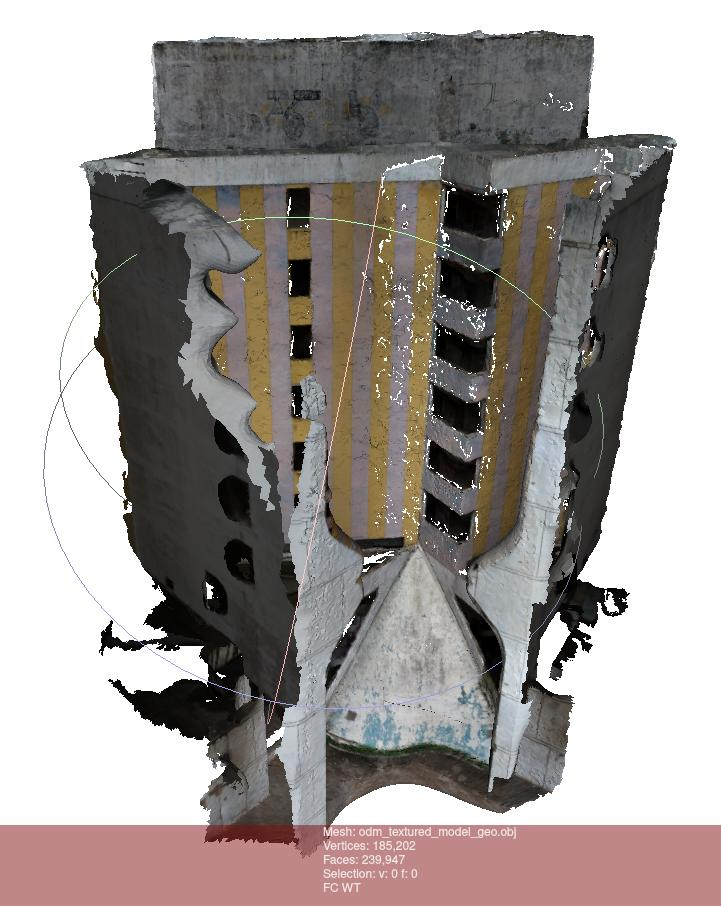
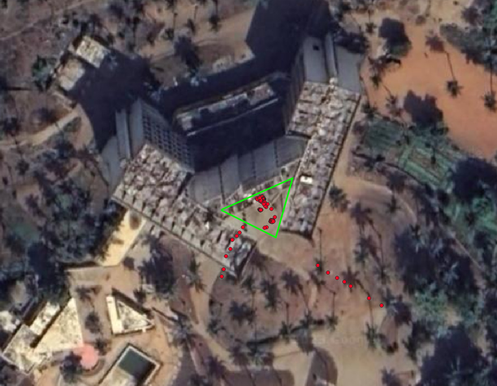
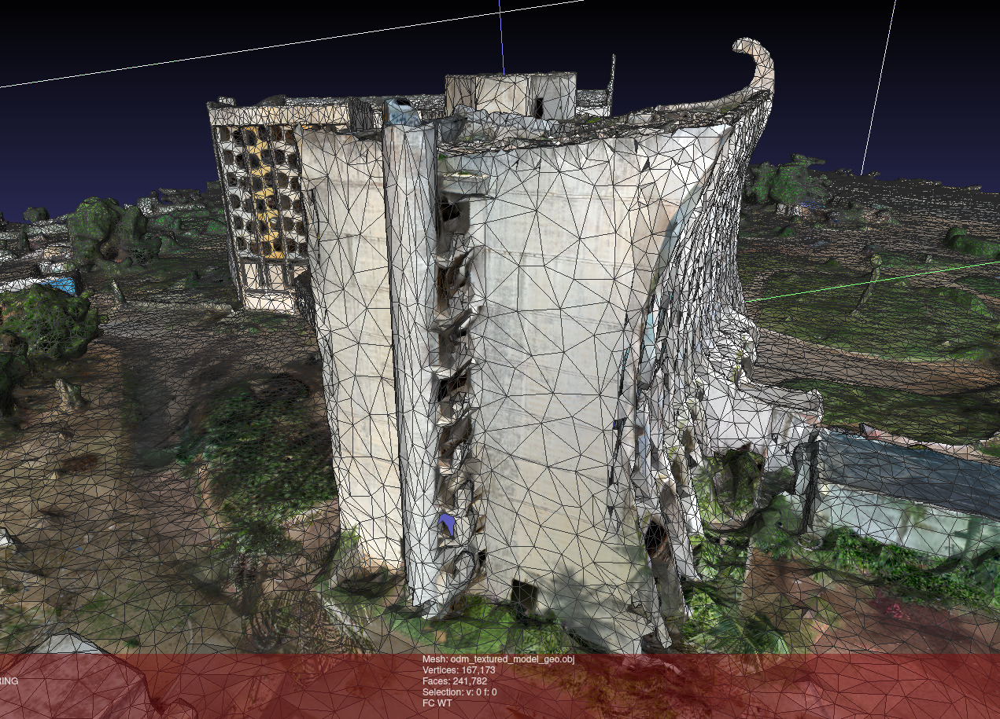
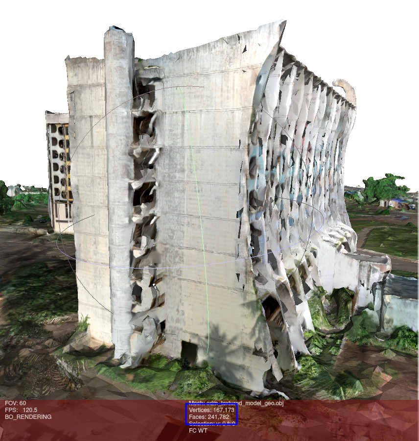
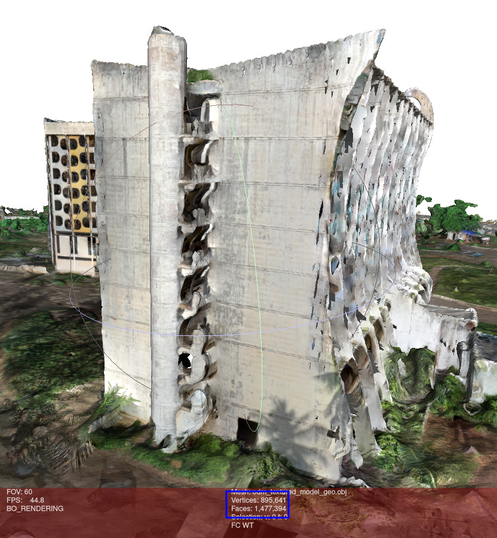

# Open Drone Map

- [**Site d'OpenDroneMap**](https://opendronemap.org/)
- [**Documentation d'OpenDroneMap**](https://docs.opendronemap.org/)
- [**Dépôt d'OpenDroneMap**](https://community.opendronemap.org/)
- [**Forum d'OpenDroneMap**](https://github.com/OpenDroneMap/ODM)

OpenDroneMap est une palette d'outils de photogrammétrie open source permettant de transformer des images aériennes (généralement prises par un drone) en cartes et en modèles 3D. Le logiciel est hébergé et distribué gratuitement sur GitHub.

Il est intéressant de faire la différence entre ODM et WebODM:

- [ODM](https://github.com/OpenDroneMap/ODM) est le projet initial d'OpenDroneMap. C'est lui qui s'occupe de tout le travail de traitement et d'analyse des images jusqu'à la génération du modèle 3D. C'est un outil en lignes de commandes.

- [WebODM](https://github.com/OpenDroneMap/WebODM) est une interface web permettant d'utiliser ODM plus facilement, à travers une interface graphique.

Nous utilisons ici OpenDroneMap afin de générer le modèle 3D de l'Hôtel de la Paix. L'utiliser en lignes de commandes nous permet de paramétrer les différentes options plus facilement. Elles sont cependant presque toutes disponibles également avec WebODM.

OpenDroneMap peut être utilisé dans différents buts :

- Surveillance des cultures.
- Cartographier des zones terrestres.
- Effectuer des analyses hydrologiques.
- Rendre compte de l'avancement des travaux de construction.
- Classer et compter les arbres.
- ...

## Installation

Voir la [documentation d'Open Drone Map](https://docs.opendronemap.org/installation/) qui est très claire.

Dans notre cas, nous avons utilisé la version Docker comme recommandé dans la documentation.

Dans la suite de ce document, nous montrerons les commandes avec Docker.

## Utilisation

> Nous expliquons ici l'utilisation d'OpenDroneMap. Sachez cependant qu'elle est plus détaillée dans le **README** du [dépôt d'OpenDroneMap](https://github.com/OpenDroneMap/ODM#readme).

Pour une structure de fichiers comme ceci :
  
```plaintext
my_datasets
├── mission_1
│   ├── images
│   │   ├── img_1.jpg
│   │   ├── img_2.jpg
│   │   ├── ...
│   │   └── img_n.jpg
├── mission_2
├── ...
└── mission_n
```

> ⚠️ Les images doivent **obligatoirement** être dans un dossier `images` à la racine de la mission.

Pour reconstruire la mission 1, il faut lancer la commande suivante (après avoir lancé de *docker daemon*):

```bash
docker run -ti --rm -v <chemin_vers>/my_datasets:/datasets opendronemap/odm --project-path /datasets mission_1
```

## GPU

Afin d'accélérer le processus de reconstruction, il est possible d'utiliser le GPU de la machine, si elle en possède un.
Pour cela, il faut ajouter l'option `--gpus all` à la commande et utiliser l'image Docker `opendronemap/odm:gpu`.

```bash
docker run -ti --rm -v <chemin_vers>/my_datasets:/datasets --gpus all opendronemap/odm:gpu --project-path /datasets mission_1
                                                           ^^^^^^^^^^                 ^^^^
```

> ⚠️ D'après @Saijin_Naib, Community Support sur le [forum OpenDroneMap](https://community.opendronemap.org/) et contributeur de [OpenDroneMap/ODM](https://github.com/OpenDroneMap/ODM), la [détection et l'extraction des points d'intérêts est bien plus robuste sur CPU](https://community.opendronemap.org/t/post-processing-after-odm/16314/5?u=adrien-anton-ludwig).

## Processus de reconstruction recommandé

Deux options s'offrent à nous :

1. Reconstruire chaque mission séparément et fusionner les nuages de points.
2. Reconstruire l'ensemble des missions en même temps.

Avantages et inconvénients de chaque méthode :

| Méthode | Avantages | Inconvénients |
| :-----: | :-------: | :-----------: |
| 1 | - Plus facile à mettre en place. <br> - Plus facile à corriger en cas d'erreur. <br> - Nécessite moins de RAM. | - Compliqué de recaler toutes les sections ensemble. <br> - Comment fusionner et retirer les erreurs ? |
| 2 | - Meilleure robustesse (en théorie). <br> - Pas de recalage à faire. <br> - Reconstruit mieux les alentours car pas de mission spécifique mais un peu de chaque mission. | - Plus difficile à corriger en cas d'erreur. <br> - Possibilité d'introduire des erreurs avec les imprécisions qui se multiplient sur le dataset général. <br> - En fonction du nombre d'images, peut nécessiter beaucoup de RAM. |

Dans tous les cas, nous recommandons de commencer par reconstruire chaque mission séparément, même vous souhaitez reconstruire l'ensemble des missions par la suite.
En effet, il est plus facile de corriger les erreurs sur une mission que sur l'ensemble des missions.

> Il n'y a pas de réponse universelle quant à la méthode à utiliser. Ces choix vont aussi dépendre du projet et de l'acquisition des images.

## Erreurs rencontrées

Nous avons rencontré 2 erreurs majeures lors de la reconstruction des missions.

### Coordonnées GPS aberrantes

Certaines images présentaient des coordonnées GPS aberrantes.
Cela peut être dû à une mauvaise réception GPS au moment de la prise de vue.

Voici un exemple de reconstruction avec des coordonnées GPS aberrantes par rapport à la même reconstruction sans ces images.

| Avec les images aberrantes | Sans les images aberrantes |
| :------------------------: | :-----------------------: |
|  |  |

Pour trouver les images aberrantes, on peut utiliser [QGIS](https://www.qgis.org/fr/site/).
Pour cela, il faut utiliser la fonction `Import GeoTagged Photos` et sélectionner le dossier contenant les images.

Certaines aberrations sont visibles à l'œil nu.
Par exemple, sur la figure ci-dessous, nous savons que toutes les images devraient être localisées dans la zone verte.
On peut donc identifier les images aberrantes.



D'autres aberrations sont moins visibles, comme des images **non localisées** ou **mal localisées**.

Pour les images mal localisées, il est possible de les mettre en évidence en utilisant la fonction `Zoom to Layer Extent` sur la couche `Photos`.

Les images non localisées n'apparaissent pas sur la carte.
On peut les trouver en sélectionnant toutes les images visibles sur la cartes et en inversant la sélection.

> ⚠️ FIXME ⚠️
> EIl faudrait encore explorer la possibilité de reconstruire sans utiliser les coordonnées GPS des images.

### Images non exploitables

Comme évoqué sur la page précédente, nous recommandons de supprimer les images qui ne sont pas exploitables.

Voici un exemple d'images que nous avons oublié de supprimer et qui ont généré une erreur lors de la reconstruction.


## Paramètres explorés

Les paramètres à utiliser varient beaucoup d'une mission à l'autre.

Nous allons nous intéresser aux paramètres que nous avons explorés, lors de notre projet.

N'hésitez pas à explorer l'ensemble des paramètres dans [la documentation d'ODM](https://docs.opendronemap.org/arguments/).
Nous recommandons également vivement le livre [OpenDroneMap: The Missing Guide](https://odmbook.com/), nous ayant aidé à comprendre beaucoup de points sur le fonctionnement d'OpenDroneMap.

Nous remercions la [communauté d'OpenDroneMap](https://community.opendronemap.org/) pour [leur aide sur le forum](https://community.opendronemap.org/t/post-processing-after-odm/16314?u=adrien-anton-ludwig) qui nous a guidé dans nos choix.

### `mesh-size`

OpenDroneMap offre la possibilité de limiter la taille du maillage généré, afin de réduire la taille du fichier final et de réduire le temps de reconstruction, en utilisant le paramètre `--mesh-size`.

Par défaut, la valeur est de `200000`, ce qui signifie que le maillage ne doit pas dépasser 200 000 sommets. Cela ne prend pas en compte la taille de la scène ou la densité des points. Cela peut amener à des maillages très différents en fonction de la scène. Par exemple, un maillage de 200 000 sommets pour une scène de 100 m² n'aura pas la même densité qu'un maillage de 200 000 sommets pour une scène de 1000 m². Exemple en image :

| Une façade | Bâtiment entier |
| :------: | :-------------: |
|  |  |

Nous pouvons constater que les deux maillages ont à peu près le même nombre de sommets et de faces mais une densité très différente.

On peut supposer que la densité plus faible sur l'image ci-dessus, à droite, crée des imprécisions : cage d'escalier et angles supérieur droit dans cet exemple.

Pour éviter que le faible nombre de sommets limite la reconstruction, nous avons donc utilisé le paramètre `--mesh-size` avec une valeur de `1000000`. Cependant, cela n'a pas eu l'effet escompté. Voici une comparaison :

| `--mesh-size 200000` | `--mesh-size 1000000` |
| :------------------: | :-------------------: |
|  |  |

Nous pouvons constater que la précision n'a pas augmenté dans la cage d'escaliers et sur l'angle du mur. Nous savons cependant que cette façade peut être très bien reconstruite car nous obtenons une bonne précision lorsque nous la traitons seule. Dans ce cas, nous pouvons alors supposer que c'est le nuage de points qui limite la reconstruction et non le maillage. Cela nous amène aux paramètres suivants.

### `feature-quality` and `min-num-features`

Une des premières (et plus importantes) étapes de la reconstruction est la détection et l'extraction des points d'intérêts (*features*). C'est cette étape qui va permettre de mettre en correspondance les images entre elles et de reconstruire la scène.

OpenDroneMap offre la possibilité de contrôler la qualité de ces points d'intérêts avec les paramètres `--feature-quality` et `--min-num-features`.

Le paramètre `--feature-quality` permet de contrôler le redimensionnement des images. Il accepte les valeurs suivantes : `ultra`, `high`, `medium`, `low`, `lowest`. Par défaut, la valeur est `high`, cela correspond à un redimensionnement à 1/2. Pour obtenir de meilleurs résultats, nous avons utilisé la valeur `ultra`, ce qui revient à ne pas redimensionner les images. Cependant, cela augmente le temps de reconstruction.

Le paramètre `--min-num-features` permet de contrôler le nombre de points d'intérêts à extraire pour chaque image. Par défaut, la valeur est `10000`. Augmenter cette valeur permet d'augmenter le nombre de points d'intérêts détectés. Cela est possible en abaissant progressivement les contraintes pour la qualité de ces points. Le résultat obtenu est en général de meilleure qualité. Cependant, cela augmente aussi le temps de reconstruction. Pour obtenir un indicateur de la valeur à utiliser, on peut regarder la partie `Features` dans le fichier `odm_report/report.pdf` généré à la fin de la reconstruction.

### `pc-quality`

Une autre étape importante de la reconstruction est la génération du nuage de points. C'est cette étape qui va permettre de générer le maillage et le modèle 3D.

OpenDroneMap offre la possibilité de contrôler la qualité de ce nuage de points avec le paramètre `--pc-quality` (pour "Point cloud quality"). Ce paramètre influence la résolution de la  carte de profondeur ([*depthmap*](https://en.wikipedia.org/wiki/Depth_map)) et donc la densité du nuage de points.

Il accepte les valeurs suivantes : `ultra`, `high`, `medium`, `low`, `lowest`. Par défaut, la valeur est `medium`. Attention, une valeur trop haute peu introduire du bruit. Il faut également prendre en compte que chaque palier multiplie le temps de calcul par 4 environ.
