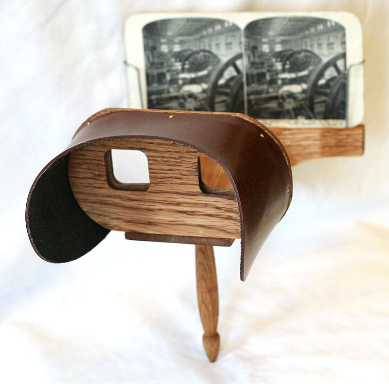
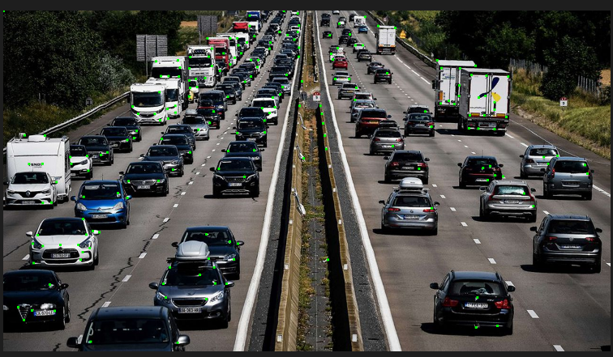
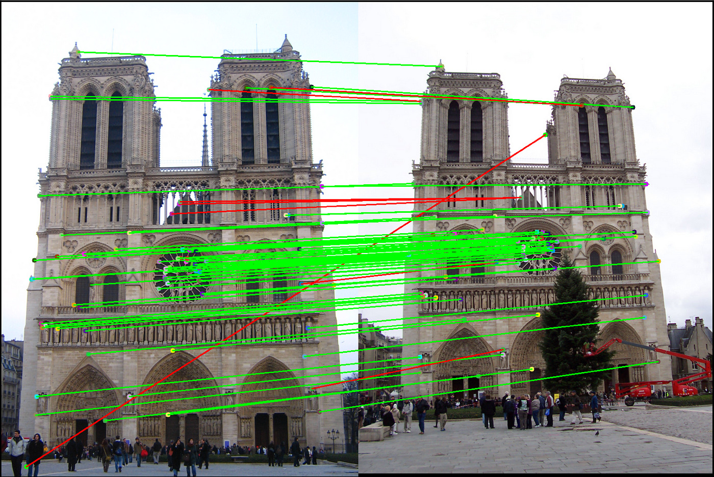
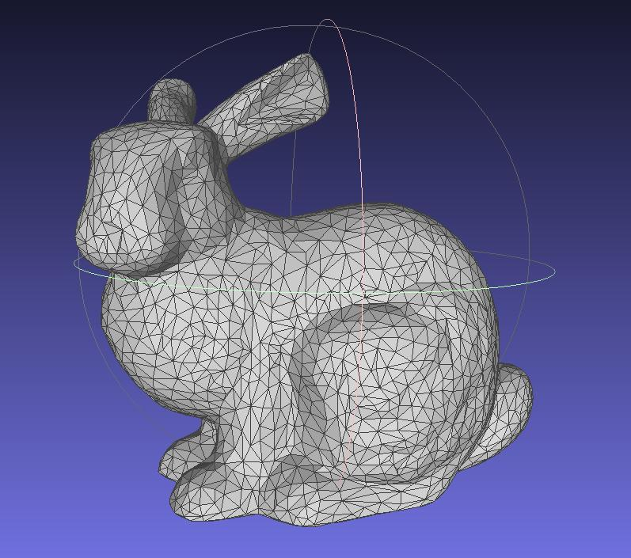
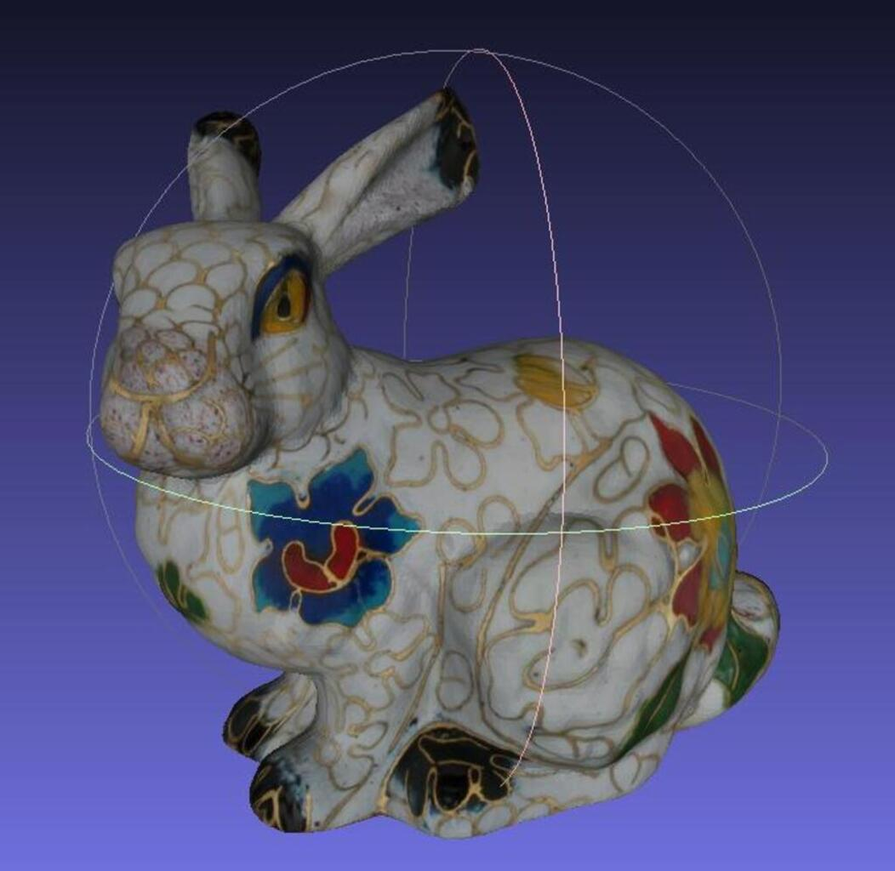

# Quelques notions de photogrammétrie

> Cette section permet simplement d'introduire la notion de [photogrammétrie](https://fr.wikipedia.org/wiki/Photogramm%C3%A9trie). Le lecteur est encouragé à faire des recherches sur ce sujet par lui même. Beaucoup de ressources, plus complètes, existent à ce sujet.

D'après une définition d'[IGN France](https://www.ign.fr/institut/kiosque/la-photogrammetrie#:~:text=La%20photogramm%C3%A9trie%20est%20une%20technique,vues%20photographiques%20de%20cet%20objet.), `"La photogrammétrie est une technique de mesure qui consiste à déterminer la forme, les dimensions et la situation d’un objet dans l’espace à partir de plusieurs prises de vues photographiques de cet objet."`.

Le fonctionnement repose sur la [stéréoscopie](https://fr.wikipedia.org/wiki/St%C3%A9r%C3%A9oscopie), principe qui reprend la vision humaine : obtenir une images en 3 dimensions à partir de deux images en 2 dimensions.
Pour l'humain, c'est le cerveau qui traite les deux images que nous voyons, une par oeil, pour en obtenir une en 3D.
La stéreoscopie est une méthode ancienne, apparue bien avant l'informatique et même avant la photographie.
Le même principe est utilisé au cinéma avec des projections de films en 3D.

<figure align="center">
    
    <figcaption>Stéreoscope de Holmes</figcaption>
</figure>

Aujourd'hui, il est possible avec un ordinateur de simuler les mêmes calculs que fait notre cerveau pour que lui aussi puisse obtenir des images 3D à partir d'images 2D. C'est grâce à cela que nous pourrons réaliser une reconstruction 3D à partir d'images 2D. Nous allons présenter les étapes principales d'une reconstruction 3D.

> 📖 Nous vous conseillons vivement d'aller lire des sources plus complètes sur le sujet. Voici quelques exemples :
>
> - L'article [Introduction To Feature Detection And Matching](https://medium.com/data-breach/introduction-to-feature-detection-and-matching-65e27179885d)
>   est une bonne base pour comprendre les étapes de la détection au matching.
> - Le livre d'Open Drone Map [A Comprehensive Guide To Use OpenDroneMap](https://odmbook.com/)
>   explique toute la file de reconstruction, de manière simple et claire.

## Détection de points d'intérêt ou *features*

Pour commencer, il est nécessaire de détecter dans chaque image ce que l'on appelle des points d'intérêt ou *features* en anglais. Mais qu'est-ce que c'est ?

Ce sont des points dans l'image dont l'information environnante est suffisament spécifique pour qu'ils soient reconnus dans différentes images. Plus concrètement, il va s'agir par exemple du :

- coin d'un meuble,
- pic d'une montagne,
- angles d'un bâtiments,
- bord d'un oeil,
- ...

Différents algorithmes existent pour la détection de points d'intérêt, chacun ayant ses particularités. [Open Drone Map](https://opendronemap.org/), que nous utiliserons pour la reconstruction, utilise [SIFT](https://en.wikipedia.org/wiki/Scale-invariant_feature_transform) par exemple.

<figure align="center">
    
    <figcaption>Détection de points d'intérêt - Algorithme d'<a href="https://en.wikipedia.org/wiki/Harris_corner_detector">Harris</a></figcaption>
</figure>

On peut voir dans cette images que les points détectés sont en effet placés là ou ils pourront être reconnus :

- angles de pare brise,
- angles des camions,
- rétroviseurs,
- ...

## Description des points

Pour pouvoir identifier chaque point, nous avons besoin d'utiliser un descripteur. Ce dernier va, comme son nom l'indique, décrire le point. En langage humain, une descriptions pourrait ressembler à : "Le point est un angle marron, entouré d'un peu de rouge et de points verts". L'ordinateur va plutôt utiliser des nombres pour caractériser toutes les informations du point, lui créant ainsi une identité.

## Association des points entre eux ou *matching*

L'information de profondeur s'obtient en ayant un même point sur plusieurs images dont le point de vue est différent. Pour faire cela, il faut trouver pour chaque point, toutes les images sur lesquelles il est présent. Grâce à la phase de description, nous allons pouvoir vérifier la ressemblance de tous les points de chaque image avec les points des autres images.

 L'image ci-dessous illustre un résultat de matching entre deux images.

<figure align="center">
    
    <figcaption>Résultat de matching - Image issue de cet <a href="https://medium.com/data-breach/introduction-to-feature-detection-and-matching-65e27179885d">article</a></figcaption>
</figure>

## Meshing

Une fois l'association des points d'intérêt faite, un nuage de points 3D peut être généré. Ensuite, un algorithme de meshing est appliqué pour obtenir une surface. Ce dernier va générer des triangles entres les points du modèle 3D, qui constitueront la surface. Le nombre de triangles peut être paramétré. Plus il y en a, meilleure la résolution sera (et réciproquement).

| Nuage de points | Mesh |
| :-------------: | :--: |
|  |  |

## Texturing

Cette étape permet d'appliquer de la couleur au modèle afin de le rendre plus réaliste. Comme dit dans [A Comprehensive Guide To Use OpenDroneMap](https://odmbook.com/), à cette étape nous n'avons qu'une `"soupe de polygones"`.

Pour donner de la couleur et texture à notre modèle, on crée un patchwork à partir des images utilisées pour la reconstruction. Puis, on vient "plaquer" ce dernier sur le mesh.

| Texture | Mesh texturé |
| :-------------: | :--: |
|  |  |
