# Préparation

[📑 Manuel d'utilisation du Mavic Air 2](https://dl.djicwdn.com/downloads/Mavic_Air_2/Mavic_Air_2_User_Manual_v1.6_enIII.pdf)

## Préparation du drone

Pour ne pas perdre de temps sur le terrain, il est important de faire quelques préparatifs.

1. Prenez connaissance du [Manuel d'utilisation du Mavic Air 2](https://dl.djicdn.com/downloads/Mavic_Air_2/Mavic_Air_2_User_Manual_v1.6_enIII.pdf).

2. Commencez par installer l'application **Litchi Fly** si ce n'est pas déjà fait ( ⚠️ l'application peut être installée sur trois appareils simultanément au maximum) : 
    - [Lien sur Google Play](https://play.google.com/store/apps/details?id=com.aryuthere.visionplus&utm_source=global_co&utm_medium=prtnr&utm_content=Mar2515&utm_campaign=PartBadge&pcampaignid=MKT-Other-global-all-co-prtnr-py-PartBadge-Mar2515-1)
    - [Lien sur l'App Store](https://apps.apple.com/app/id1059218666?mt=8&uo=4)

3. Installez l'application **DJI** qui correspond à votre modèle de drone (nécessaire pour les mises à jour du drone et la désactivation des *No Flight Zone* dont nous parlerons plus tard). ⚠️ Sur Android, l'application n'est pas disponible sur le *Play Store*. Il faut télécharger et installer un *apk* directement depuis le site de DJI. Beaucoup de fausses applications sont disponibles sur les stores. Apple ou Android, nous vous conseillons de télécharger les applications depuis le site de DJI  : 
    - [DJI Fly](https://www.dji.com/downloads/djiapp/dji-fly) : Mavic Air 2
    - [DJI Go 4](https://www.dji.com/downloads/djiapp/dji-go-4) : Mavic Pro 1, Phantom 4

4. Branchez votre téléphone à la télécommande et autorisez tous les transferts de données. À un stade, votre téléphone vous proposera de toujours utiliser `DJI Fly` ou `Litchi FLy`. Comme il faudra souvent basculer entre les deux, faites en sorte de ne pas activer cette option pour pouvoir choisir à chaque connexion. Allumez le drone et la télécommande en faisant, sur chacun, un clic rapide et un clic long sur le bouton *power*. Rendez-vous maintenant dans l'application `DJI Fly`.
<figure align="center">
    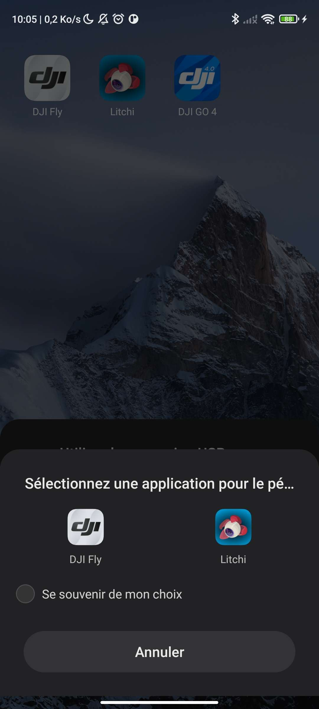
    <figcaption>Ne surtout pas cocher "Se souvenir de mon choix"</figcaption>
</figure>

5. Vous aurez peut-être des calibrations à faire, suivez les instructions de l'application. Ensuite, rendez-vous dans le menu pour vérifier si des mises à jours firmware sont disponibles en faisant : `... > À propos > Firmware de l'appareil > Rechercher des mises à jour`

<figure align="center">
    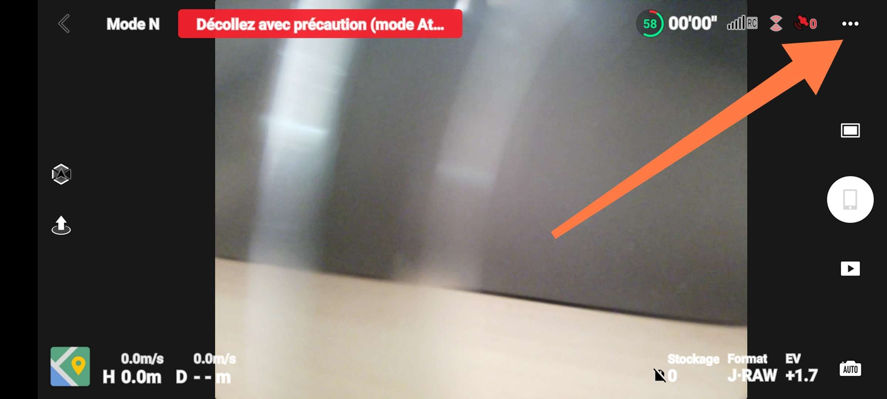
    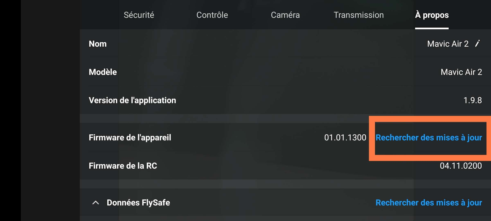
    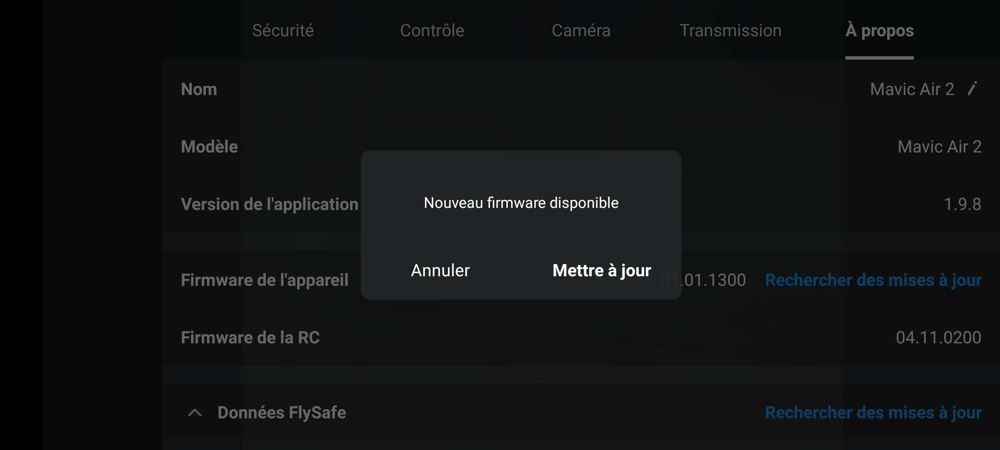
    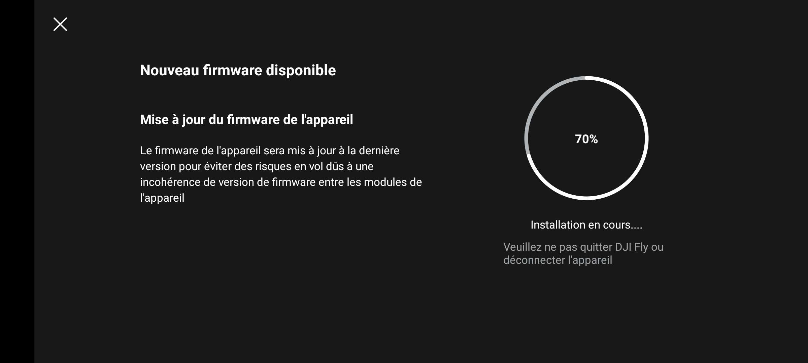
    <figcaption>Étape pour les mises à jours firmware</figcaption>
</figure>

6. Fermez l'application `DJI Fly` puis ouvrez `Litchi Fly`. (Il faut bien fermer totalement l'application et non pas la mettre seulement en fond). Vérifiez que votre drone se connecte bien. Si c'est le cas, vous être prêt pour les prochaines étapes !

7. Chargez toutes les batteries et la manette avant tout vol ! Même si le drone n'a pas été utilisé depuis le dernier chargement, les batteries se déchargent lorsqu'elles sont stockées.

## Le matériel pour les vols

Peu de matériel est à prévoir en plus du drone (le matériel du drone est dans sa sacoche) : 
- Batteries chargées.
- Télécommande chargée.
- 🕶️ Lunettes de soleil pour l'opérateur (surveiller le drone dans le ciel peut être compliqué avec le soleil).
- 🕶️ Lunettes de soleil pour le drone, ou plutôt, les filtres UV de la caméra. Cela permet que les images soient sur exposées et donc inutilisables.
- Tapis de décollage et atterrissage si on est dans une zone poussiéreuse (sable, terre, ...). Cela évite que le sol se soulève et endommage le drone. Un tapis de voiture fait très bien l'affaire.
- 💻 Ordinateur pour ré ajuster les missions Litchi sur place.

## Vol d'essai

Avant d'opérer le vol final, il faut que vous soyez familier avec le drone et les applications qui permettent de le contrôler. Trouvez un terrain assez dégagé pour faire vos essais. Une fois que vous connaissez le lieu de l'essai, planifiez quelques missions que vous pourrez essayer sur place. Cela permettra de vérifier que vous avez bien compris les étapes de planification de vol et de faire un premier test avec le logiciel de reconstruction. Vous pourrez ainsi avoir une meilleure vision de la file générale des opérations. De plus, vous pourrez éventuellement détecter des problèmes dans la prise d'image de la mission et rectifier cela pour la véritable acquisition.

> 📆 Idéalement, celui-ci a lieu au début du projet, avant la planification des missions automatiques de la mission finale.

Essayez les différents filtres UV pour la caméra afin de vous familiariser avec leur mise en place et effet. Prenez des photos avec chaque filtre installé.

### Vol manuel

Commencez par faire un petit tour en vol manuel avec le drone. Bien que les missions soient automatisées, il faut souvent intervenir à la main. Pour cela, commencer par faire décoller le drone en appuyant sur l'icône correspondant dans `DJI Fly` ou `Litchi Fly`. Le drone va s'élever à 1,2m d'altitude et vous pourrez alors le contrôler. Le point de décollage est enregistré comme point de *Home* par le drone. Il reviendra ici lorsque vous lui direz d'atterrir en mode *RTH (Return To Home)*.

<figure align="center">
    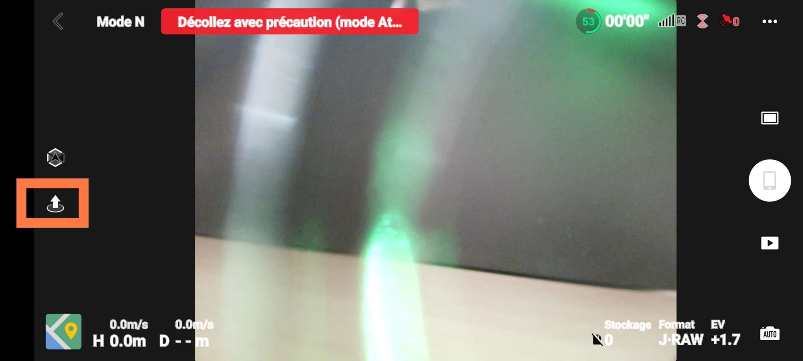
    <figcaption>Icône de décollage du drone (DJI Fly). La même icône est utilisée sur Litchi Fly</figcaption>
</figure>

Plusieurs configurations de commandes peuvent être utilisées pour les joysticks. Ils peuvent être changés dans `DJI Fly`. Trois modes pré-configurés existent (cf. p32 [Manuel d'utilisation du Mavic Air 2](https://dl.djicwdn.com/downloads/Mavic_Air_2/Mavic_Air_2_User_Manual_v1.6_enIII.pdf)
). Voici le mode utilisé pour le drone [Mavic Air 2](https://www.dji.com/mavic-air-2/specs) de [Mitsio Motu](https://www.mitsiomotu.com/) : 
<figure align="center">
    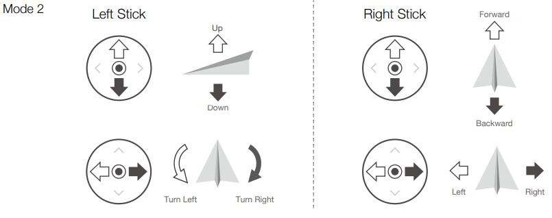
    <figcaption>Commandes des joysticks (Mode 2)</figcaption>
</figure>

À l'arrière de la télécommandes, des boutons sont disponibles pour gérer la partie caméra, photos et vidéos :

<figure align="center">
    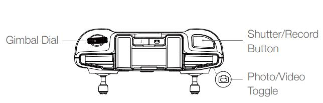
    <figcaption>Inclinaison caméra, prise de photos et vidéos</figcaption>
</figure>

Amusez vous, c'est l'occasion de prendre de jolies photos ! 📸

### Vols automatiques

C'est le moment de tester les vols que vous avez préparés pour cette sessions d'essai. 

<figure align="center">
    
    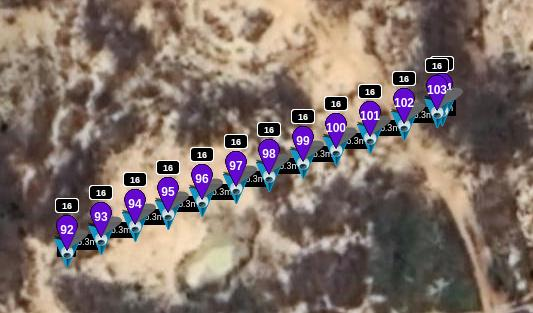
    <figcaption>Exemples de mission de test en terrain dégagé</figcaption>
</figure>

Rendez vous dans la section `Waypoint` dans l'application et chargez votre mission.[^rappel] Réglez ensuite le degré de la caméra à celui souhaité pour la mission grâce à la roulette en haut à gauche de la manette. Vous pouvez voir à quel degré exactement la caméra est inclinée, comme illustré dans l'image ci-dessous :

<figure align="center">
    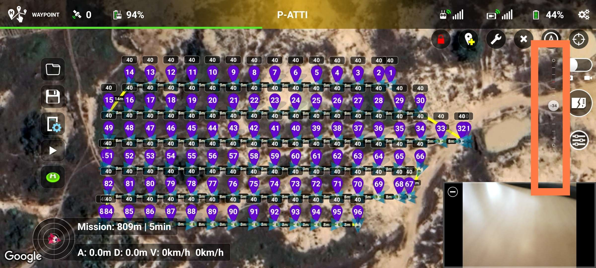
    <figcaption>Réglage de l'inclinaison de la caméra</figcaption>
</figure>

Vérifiez que les photos seront prises au bon format. Le drone [Mavic Air 2](https://www.dji.com/mavic-air-2/specs) peut enregistrer les images en [JPEG](https://fr.wikipedia.org/wiki/JPEG) ou en [JPEG](https://fr.wikipedia.org/wiki/JPEG) et [RAW](https://fr.wikipedia.org/wiki/RAW_(format_d%27image)). Le format RAW est très adapté pour retoucher les images mais est beaucoup plus lourd que le format JPEG. Si l'on ne souhaite pas retoucher les images, il n'est pas nécessaire de les enregistrer dans ce format. Pour la reconstruction 3D ce format n'est pas forcément nécessaire. 

<figure align="center">
    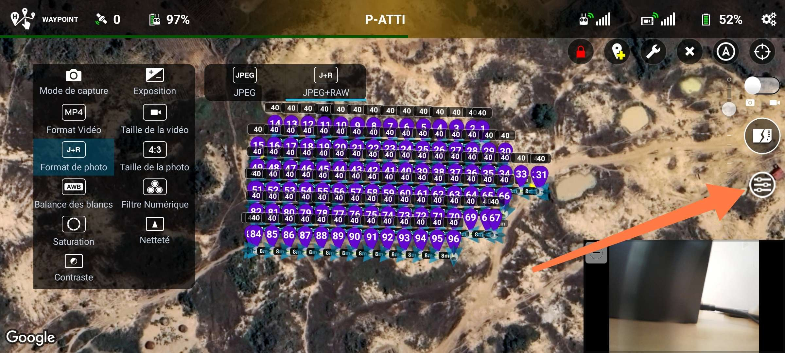
    <figcaption>Réglage du format d'enregistrement des photos</figcaption>
</figure>

Assurez vous que les images sont bien enregistrées sur la mémoire externe et non interne du drone (8Go, elle sera vite saturée, encore plus si vous enregistrez les fichiers RAW). Pour cela, rendez-vous dans les paramètres : `... > Caméra > Emplacement de stockage`.

<figure align="center">
    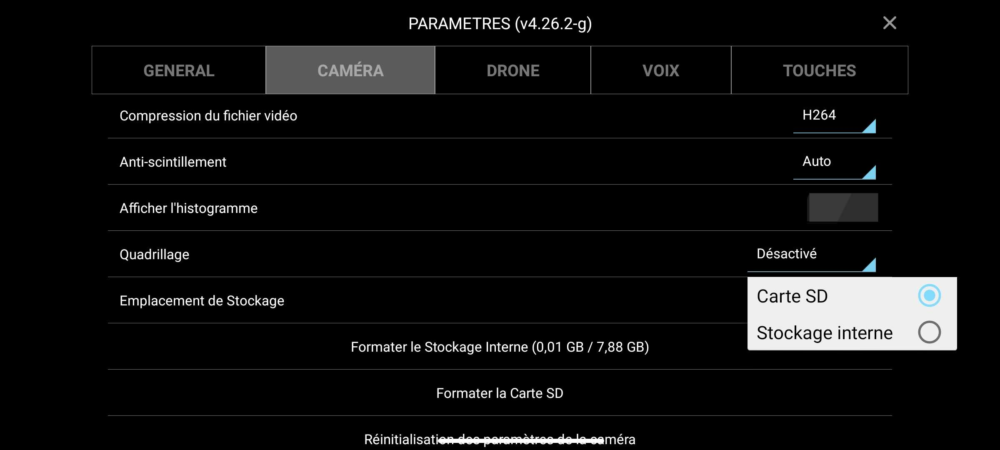
    <figcaption>Choix de l'emplacement de stockage</figcaption>
</figure>

Lancez ensuite simplement le vol en cliquant sur `Play`.

<figure align="center">
    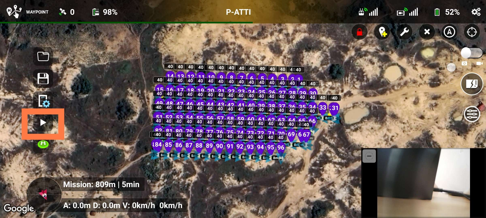
    <figcaption>Démarrage d'une mission Litchi Fly</figcaption>
</figure>

C'est parti ! Plus qu'à laisser le drone faire son travail. Vérifiez tout de même qu'il effectue bien ce qui est prévu et que ça correspond à ce que vous souhaitiez. Vous perdez alors tout le contrôle du drone. Cependant vous pouvez interagir avec après avoir cliqué que les boutons `pause ⏸️` ou `stop ⏹️` : 
- `pause ⏸️` : Les joysticks n'ont toujours pas d'effet. Le drone ne peut pas être déplacé. Vous pouvez cependant rectifier le *heading* du drone en faisant glisser votre doight sur l'image sur votre téléphone. Cependant cette solution n'est pas très précise. La mission continue depuis ce point quand vous la relancez. IL est très utile dès que vous avez un doute sur une potentielle collision du drone. Dès que vous avez un doute, utilisez le. Vous aurez alors le temps de vérifier si le drone peut continuer ou non.
- `stop ⏹️` : La mission est arrêtée. Vous reprenez tout le comportement du drone. Quand vous voyez que vous allez rencontrer un obstacle, il faut appuyer sur ce bouton. Vous pouvez ensuite contourner manuellement l'obstacle. Ensuite, relancez la mission au *waypoint* le plus proche et sécuritaire, après l'obstacle. Comme Litchi n'indique pas à quel *waypoint* de la mission est le drone, ce sera à vous d'estimer à quel *waypoint* reprendre la mission.

## Reconnaissance sur le terrain

La reconnaissance sur le terrain est elle aussi importante. Elle permet d'identifier certains problèmes potentiels et de mieux comprendre l'organisation d'un bâtiment. Par exemple, à l'hôtel de la paix, nous avons constaté qu'il y avait de nombreux palmiers proches des façades. En plus d'être problématiques pour la prise d'images et la reconstruction, cela augmente les risques de collision.

> 📆 Idéalement, elle a lieu avant ou au début de la planification des missions automatiques.

C'est également l'occasion de faire des relevés de hauteur de bâtiment si nécessaire. La méthode à suivre est renseignée dans la partie **Le toit** de la section [Planification de la mission](../planification/planification.md).

Si l'occasion se présente, il peut être intéressant de prévoir un premier survol très grossier de la zone. Vous pouvez pour cela prévoir une mission en grille croisée, caméra à 45° en altitude assez haute (>40m)..
___
[^rappel]: Voir la partie [Importation sur Litchi Fly](../planification/litchi.md), section **Application mobile** pour voir comment faire.