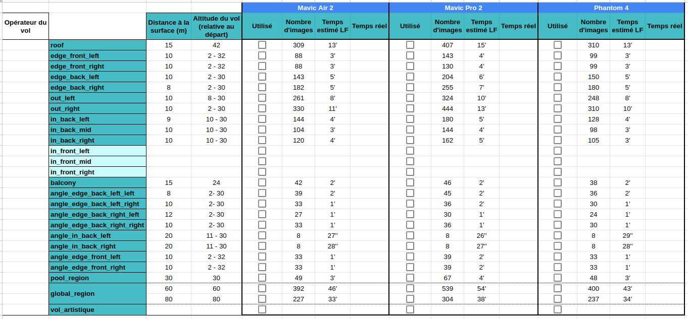

# Réalisation

> Il est indispensable d'avoir pris connaissance de la partie [Préparation](preparation.md) avant de lire cette section et d'opérer le vol final.
> Cette dernière présente de nombreux points à connaître sur les applications et le pilotage du drone. Les étapes de préparation sont les mêmes qu'ici.

L'acquisition des images c'est une étape concrète et importante. Alors c'est parti ! 💪

Pour le jour J, assurez vous que toutes vos batteries sont chargées à bloc. La liste du matériel à emporter est la même que présentée dans [Préparation](preparation.md), section **Le matériel pour les vols**. Vous pouvez éventuellement y ajouter une liste imprimée de tous les vols à effectuer pour suivre l'avancement de la journée.

<figure align="center">
    
    <figcaption>Fiche de suivi pour le vol à l'hôtel de la paix</figcaption>
</figure>

Nous avons déjà parlé dans la partie [Préparation](preparation.md) de tout ce qui était relatif au pilotage du drone et au lancement des missions. Nous présenterons ici des problèmatiques spécifiques que vous pourrez rencontrer le jour J.

## No flight zone

Si vous vous trouvez dans une zone considérée comme une *No flight zone* (vers un aéroport par exemple), le drone ne voudra pas décoller. Vous pouvez cependant forcer le décollage.

Pour cela, rendez-vous dans l'application `DJI Fly` (ou autre application DJI/constructeur correspondant à votre modèle de drone) :
- `DJI Fly` : 
    - Faites décoller le drone. Il va s'élever à 1,2m.
    - Alors, l'application vous dira qu'il ne peut pas décoller (oui, oui, alors que le drone a déjà décollé).
    - Acceptez toutes les conditions pour vous porter garant en cas d'incident. Une vérification d'identité peut-être demandée. Suivez les instructions si c'est le cas.
- `DJI Go 4` :
    - Appuyez sur le bouton de décollage du drone.
    - Il va refuser de décoller en vous expliquant la raison dans un pop-up.
    - Tout en bas du pop-up, vous pouvez cocher deux cases pour vous porter garant également en cas d'incident.
    - Validez tout en bas du pop-up.
    - ⚠️ Dans la version 4.3.54 de `DJI Go 4`, un bug faisait qu'on ne pouvait pas dérouler le pop-up et donc jamais accéder au bouton `valider`. Nous n'avons pas trouvé d'autre solution que de passer sur un autre téléphone avec un écran plus large. Sur l'un des téléphones, une erreur se produisait également en validant. Nous avons encore dû changer de téléphone pour réussir cette étape.

Fermez alors l'application `DJI` et ouvrez `Litchi Fly`. Vous devez pouvoir décoller.

> ➡️ Cette étape doit être répétée à chaque démarrage du drone.

## Murs & surfaces verticales

Si vous faites un vol vertical, il est probable que vous ayez réglé le *heading* du drone en *Initial*. Dans ce cas, assurez-vous que la position de départ au sol du drone est bien perpendiculaire à la façade acquise et avec la caméra en direction de ce mur. N'oubliez pas de régler la caméra à 90° avant de décoller.

Vous pouvez ré ajuster le heading au cour de la mission en cliquant sur `pause ⏸️`, comme exepliqué dans la section **Vols automatiques** de [Préparation](preparation.md).

## Obstacles et capteurs

Le drone possède des capteurs pour détecter les obstacles. Sur le [Mavic Air 2](https://www.dji.com/mavic-air-2/specs), ils sont situés à l'avant et à l'arrière seulement. Si le drone détecte un objet trop proche de lui, même s'il est en mission, il s'arrêtera. Dans ce cas, suivez la procédure du bouton `stop ⏹️`, comme exepliqué dans la section **Vols automatiques** de [Préparation].

Le [Mavic Air 2](https://www.dji.com/mavic-air-2/specs) n'a cependant pas de capteurs sur les côtés. Il faudra être très vigilant lors des vols latéraux (utilisés pour les vols verticaux par exemple). Si vous avec le moindre doute, appuyez sur le bouton `pause ⏸️`, rapprochez vous pour mieux évaluer la situation et prendre votre décision. 

## Gestion de la batterie

Une fois connecté au drone avec `Litchi Fly`, vous pourrez suivre l'état de la batterie de votre drone grâce à la barre d'état en haut de l'écran. Quand il atteindre **20%** de batterie restante, il vous demandera l'autorisation de rentrer afin que la batterie soit changée. Vous pouvez accepter ou continuer la mission (parfois, il est si proche qu'il n'est pas nécessaire qu'il rentre tout de suite). ⚠️ Attention cependant, veillez à le faire tout de même rentrer avant qu'il atteigne **10%** sinon il fera un atterrissage forcé là ou il se trouve. Ça peut être très problématique si vous vous trouvez au dessus d'un toît ou arbre par exemple. Si jamais cela arrivait, sachez que vous pouvez tout de même le décaler droite/gauche et avant/arrière avec les joysticks mais nous n'avez pas de contrôle haut/bas. Il faut donc être attentifs et réactif si cela arrive.

Dans tous les cas, une fois que votre drone est revenu, changez sa batterie.

La mission a été interrompue. Quand vous relancez la mission, vous avez le choix du *waypoint* ou commencer. Malheureusement, `Litchi Fly` au cours d'une mission n'indique pas le *waypoint* ou il se situe. Ce sera donc à vous d'estimer là où vous en étiez.

## Erreurs Litchi : "Invalid 3D path"

En lançant la mission, il est possible que vous rencontriez une erreur similaire à `Invalid 3D path between waypoints 30 and 31`. IL semblerait que cette erreur se produise quand deux *waypoints* sont trop proches, dans cet exemple, les points n°30 et 31.

Dans ce cas, rendez-vous sur `Litchi Fly` (sur PC ou directement sur l'application téléphone). Supprimez le premier des points listé (ici le point n°30). Sauvegardez et synchronisez bien les appareils si vous avez édité la mission sur l'ordinateur. Relancez la mission et recommencez l'opération si nécessaire jusqu'à ce que la mission fonctionne.

> 💡 **Tip** : Si cela se produit sur une mission verticale, l'erreur va apparaître à chaque ligne de vol. Au lieu de supprimer un point et relancer la mission à chaque fois, vous pouvez identifier les *waypoints* problématiques sur toutes les lignes, tous les supprimer et sauvegarder/synchroniser une fois qu'ils sont tous faits seulement.

## Mission mal placée

Planifier ses mission sur des images satellites de mauvaise qualité fait qu'il est impossible d'avoir une bonne précision dans le placement de la mission. Il est très probable que vous vous rendiez compte sur le terrain que votre mission n'est pas placée exactement là ou le voudriez.

Pour résoudre cela, rendez-vous sur `Litchi Fly` sur ordinateur (cette modification n'est à l'heure actuelle pas possible sur téléphone). Déplacez tous les points de la mission dans le sens souhaité. Sauvegardez et synchronisez bien le téléphone. Lancez la mission, voyez si c'est mieux ou s'il faut encore éditer la mission. Dans ce cas, recommencez jusqu'à ce que la position soit satisfaisante.

