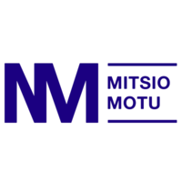
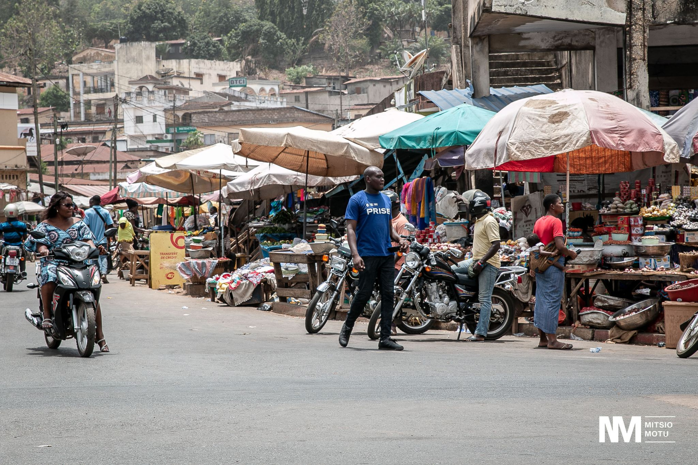

<figure align="center">
    
</figure>

# Mitsio Motu

- [Site de Mitsio Motu](https://www.mitsiomotu.com/)

Cette documentation a été rédigée dans le cadre d'un projet de cartographie 3D au sein de l'entreprise **[Mitsio Motu](https://www.mitsiomotu.com/)**. Mitsio Motu est une entreprise de conseil basée en Afrique de l'Ouest. Elle travaille avec des gouvernements, des institutions publiques et des entreprises privées pour établir des stratégies de développement en se basant sur la donnée.

Mitsio Motu réalise régulièrement des collectes de données auprès des populations d'Afrique de l'Ouest. Par exemple, en 2022, ce sont 700 collecteurs qui ont parcouru le Togo pendant 7 mois pour recenser toutes les infrastructures du pays : hôpitaux, écoles, restaurants, points d'eau, ... La donnée collectée permet de proposer des plans de déploiement d'infrastructures (lampadaires par exemple) adaptés aux besoins de la population.

<figure align="center">
    
    <figcaption>Collecteur sur  le terrain</em></figcaption>
</figure>

---

> ❔ À qui s'adresse cette documentation ?
> 
> Cette documentation regroupe : 
> - Toutes les questions que nous nous sommes posés dans la mise en place de ce projet de reconstruction 3D ainsi que les réponses sourcées que nous y avons trouvées.
> - La méthodologie que nous avons mise en place pour le projet.
> 
> Ainsi, elle s'adresse autant aux employés de **[Mitsio Motu](https://www.mitsiomotu.com/)** qu'à toute personne intéressée par la cartographie 3D de bâtiments.
> Bien que spécifique à notre projet, cette documentation est assez générale pour que chacun puisse en tirer des informations utiles.
 