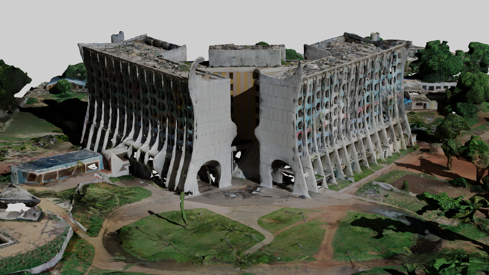

# Présentation du projet

Ce site **documente la méthodologie** mise en place pour la **cartographie 3D de bâtiments par drone**.
Il a été réalisé dans le cadre d'un projet de sauvegarde de patrimoine au sein de l'entreprise **[Mitsio Motu](./mm.md)**.

Cette documentation regroupe :

- Toutes les questions que nous nous sommes posés lors de la mise en place de ce projet de reconstruction 3D ainsi que les réponses sourcées que nous y avons trouvées.
- La méthodologie que nous avons mise en place pour le projet.

> 🤔 À qui s'adresse cette documentation ?
>
> Elle s'adresse autant aux employés de **Mitsio Motu** qu'à toute personne intéressée par la **cartographie 3D de bâtiments**.
> Bien que spécifique à notre projet, cette documentation est assez générale pour que chacun puisse en tirer des informations utiles.

Les notions présentées dans cette documentation peuvent également être utilisées pour d'autres projets. Par exemple :

- Surveillance des cultures.
- Inspection de toitures.
- Recenser et compter des arbres.
- Rendre compte de l'avancement des travaux de construction.
- ...

## Historique du projet

Ce projet a été mis en place en avril 2023 pour participer à la sauvegarde du patrimoine togolais. Cette année, l'Hôtel de la Paix, ancien hôtel phare de Lomé abandonné depuis 20 ans, menaçait d'être détruit. **[Mitsio Motu](https://www.mitsiomotu.com/)** a alors décidé de cartographier le bâtiment.

<figure align=center>
    
    <figcaption>Hôtel de la Paix (photo d'époque)</figcaption>
</figure>

Deux méthodes ont été mises en place :

- Une cartographie classique réalisée par des étudiants en architecture.
- Une cartographie 3D par drone, que nous expliquons ici.

Vous pouvez retrouver les résultats des deux méthodes sur [le site du projet](https://mitsio-motu-data.github.io/fipa/).

<figure align=center>
    
    <figcaption>Hôtel de la Paix (reconstruction 3D)</figcaption>
</figure>
