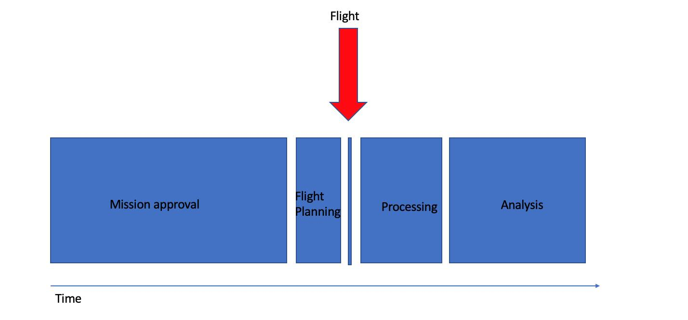
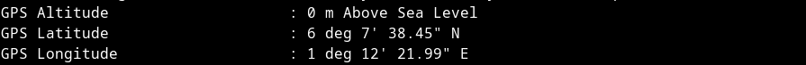
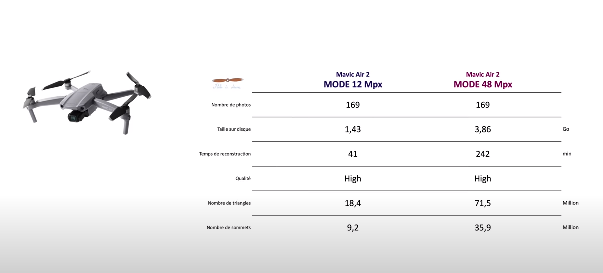
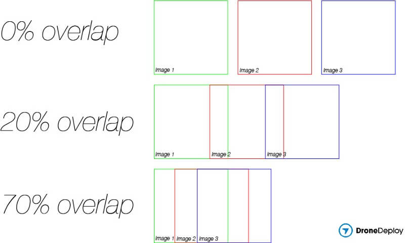
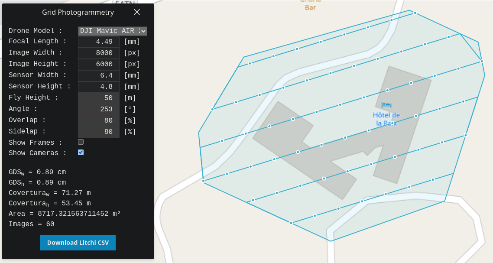
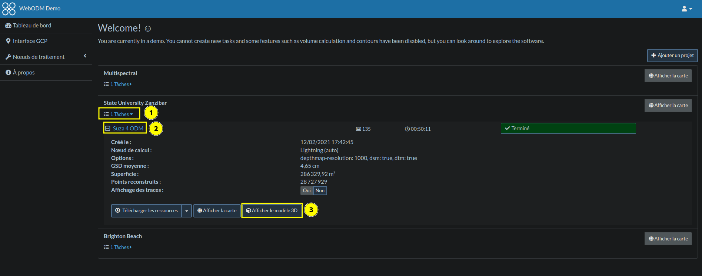
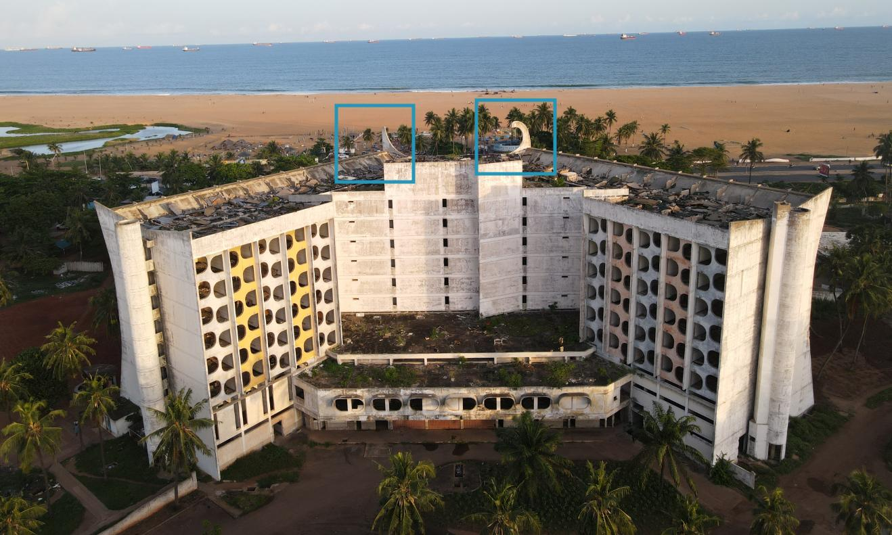

# Recherches menées

> Cette section regroupe les questions que nous nous sommes posées et les réponses que nous y avons trouvées au cour de la mise en place du projet.
> Une grande partie du contenu a déjà été abordée dans la partie **Guide**.

## Matériel à disposition

Avant de se lancer dans quoi que ce soit, nous avons besoin de faire un inventaire du matériel et des logiciels à disposition pour ce projet.

> ✅ Ce que nous avons :
>
> - [**Drone DJI Mavic Air 2**](https://www.dji.com/mavic-air-2/specs)
>   - Drone
>   - 3 batteries & chargeur
>   - Hélices
>   - Manette + chargeur
>   - Housse de transport
> - **Matériel informatique**
>   - Ordinateurs avec 16Go de RAM et GPUs

## Planning du projet

Il est important de prévoir un planning général et tenable du projet.
L'image ci-dessous illustre la répartition dans le temps des différentes étapes.
Celui-ci s'est avéré très réaliste par rapport au déroulement de notre projet.
Etant donné que c'était notre premier projet utilisant un drone, nous avons commencé par une partie "Recherches", non mentionnée sur ce planning.
Cette partie nous a pris environ le même temps que la partie "Processing".

Ce diagramme est issu d'un site de planification de vol d’UAV (Unmanned Aerial Vehicle) très intéressant à lire : [UAV Mapping Guidelines](https://uav-guidelines.openaerialmap.org/pages/07-preparing-for-the-uav-mission/). On peut voir que la manipulation du drone ne représente qu'une minorité de la mission.

<figure align="center">
    
    <figcaption>Planning de mission</figcaption>
</figure>

## GPS

Le drone **DJI Mavic Air 2** a un système de localisation **GPS+GLONASS** (GPS est américain, GLONASS est russe) d'après ses [caractéristiques](https://www.dji.com/mavic-air-2/specs).
Si suffisamment de satellites sont disponibles pour établir la localisation du drone lors de la prise de vue, les coordonnées GPS sont enregistrées dans les métadonnées de chaque image.
Les informations sont enregistrées en altitude, latitude et longitude.
Pour les visualiser, vous pouvez utiliser la commande suivante :

```bash
exiftool image.jpg
```

Vous pourrez alors lire toutes les métadonnées de l'image et trouver les lignes qui se réfèrent aux coordonnées GPS :

<figure align="center">
    
    <figcaption>Métadonnées d'altitude, latitude et longitude</figcaption>
</figure>

Nous avons trouvé deux raisons pour lesquelles les données GPS sont importantes à acquérir, et le plus précisément possible :

- Rendre plus robuste la reconstruction 3D, qui s'appuie sur celles-ci pour éviter les erreurs de correspondance entre les images.
- Localiser la reconstruction 3D dans le monde réel.

## Qualité des images

La qualité des images a son importance.
La netteté est indispensable pour le bon fonctionnement de la détection des points d'intérêt et donc pour une bonne reconstruction.
Détecter des points d'intérêt sur des images floues est très difficile.

Le drone **DJI Mavic Air 2** a plusieurs modes de capture d'images :

- Vidéo (jusqu'à 3840×2160 px)
- Photo 12 mégapixel (4000x3000 px)
- Photo 48 mégapixel (8000x6000 px)

La vidéo est très lourde à stocker, traiter et de moins bonne résolution que les photos.
Nous choisissons donc une acquisition par photos.

Les photos en 48 Mpx sont prises avec le même capteur que les photos en 12 Mpx.
Elles sont cependant beaucoup plus lourdes à stocker et traiter.
Ce choix peut être envisagé si la qualité de rendu est bien meilleure.
Cependant, l'utilisation du même capteur provoque souvent l'apparition de bruit dans les zones un peu sombres (ombres par exemple).
([Explications de l'utilisation d'un même capteur pour résolutions sortantes différentes](https://www.gsmarena.com/quad_bayer_sensors_explained-news-37459.php)).

La vidéo [Mavic Air 2 - photogrammétrie 12 vs 48 Mpx](https://www.youtube.com/watch?v=7-p04vKLEWI&ab_channel=Paladrone) effectue une comparaison entre les deux modes de prise de photo.
Ci-dessous un tableau extrait de la vidéo comparant différents points entre les prises 12 et 48 Mpx. 

<figure align="center">
    
    <figcaption>Comparaison de l'utilisation de photos en 12 et 48 Mpx sur une même mission</figcaption>
</figure>

Les 2 rendus 3D issus des missions de cette vidéo sont très similaires.
Les photos en 48 Mpx rendent parfois plus de détails mais ont également introduit du bruit sur certaines zones, ce que nous voulons éviter.
Pour toutes ces raisons, nous choisissons de capturer les images en 12 Mpx.

Il y a également la possibilité de capturer les images au format RAW en même temps que JPG.
Le tableau ci-dessous présente le nombre d'images que nous pouvons prendre avec 8Go de stockage (mémoire interne du drone) avec ou sans le format RAW.

|     | JPEG 12MP | JPEG 12MP + RAW |
|:---:|:---------:|:---------------:|
| 8Go stockage | 1599 photos | 278 photos |

## Recouvrement

L'algorithme de reconstruction 3D utilise les différences de perspectives entre les points communs de deux images.
C'est pourquoi, il est indispensable que des images successives aient une zone en commun.
On parle de recouvrement.
L'image ci dessous illustre à quoi correspond un pourcentage de recouvremet ou *overlap*.

<figure align="center">
    
    <figcaption>Pourcentages d'<i>overlap</i></figcaption>
</figure>

Nous nous sommes demandé quel serait le recouvrement optimal à choisir entre nos images.
D'après nos recherche, il est recommandé pour faire une bonne acquisition d'avoir au moins 70%
(idéalement 80%) de recouvrement horizontal et 60% (idéalement 70%) de recouvrement vertical.
Ces valeurs varient selon les sources mais correspondent aux ordres de grandeurs recommandés par
[Open Drone Map](https://docs.opendronemap.org/tutorials/#flight-height) et
[Pix4D](https://support.pix4d.com/hc/en-us/articles/203756125-How-to-verify-that-there-is-enough-overlap-between-the-images-PIX4Dmapper).

Voici une image afin d'illustrer les termes recouvrement horizontal (*forward overlap*) et vertical (*side overlap* ou *sidelap*) :

<figure align="center">
    
    <figcaption>Recouvrement horizontal (<i>forward overlap</i>) et vertical (<i>sidelap</i>)</figcaption>
</figure>

> ⚠️ Attention, les valeurs de cette illustration ne correspondent pas aux recommandations dans notre cas.

## Génération des missions

Afin d'acquérir ces images avec un recouvrement donné de manière précise, il est possible, et recommandé, de générer un parcours de vol.
Ce parcours correspond à une liste de points (coordonnées GPS et altitude) pour lesquels
le drone capturera une image selon des paramètres (orientation de la boussole, angle de la caméra, résolution, ...).
Cependant, l'application officielle [DJI Fly](https://www.dji.com/global/downloads/djiapp/dji-fly) ne supporte pas les vol planifiés.
Nous devront trouver une autre application compatible avec notre drone qui inclut cette fonctionnalité.
Différentes solutions existent, avec des avantages, inconvénients et, bien sûr, prix différents.

| Outil          | Prix   | Open Source |Avantages / Inconvénients | Fonctionne avec le gestionnaire de vol |
| :------------: | :----: | :---------: |:---------------------: | :------------------------------------------: |
| [Grid Photogrammetry](https://afbayonac.github.io/grid-photogrammetry/) | 0€ | | Très intuitif et en ligne mais manque de fonctionnalités (*cross grid* par exemple) | Litchi |
| [Ancient Land](https://ancient.land/) | 0€ | | Très intuitif et en ligne mais manque de fonctionnalités (*cross grid* et ajout de drone inconnu par exemple) | Litchi |
|  [Plugin QGIS drone_path](https://plugins.qgis.org/plugins/drone_path/) | 0€ | | | Litchi |
| [MissionPlanner](https://ardupilot.org/planner/) | 0€ | ✅ | Toutes les fonctionnalités que nous cherchons sont disponibles. Le logiciel n'est pas trop long à prendre en main. Plusieurs bugs sont cependant à relever. | Mission Planner |
| [Dronelink](https://www.dronelink.com/) | 39€ /mois /utilisateur pour la version pro avec plus d'un utilisateur ([détails](https://app.dronelink.com/pricing)). | ❌ | [Mapping des façades](https://support.dronelink.com/hc/en-us/articles/4411563374099) compris, gestionnaire de vol compris. | Dronelink |
| [DroneDeploy](https://www.dronedeploy.com/) | 329€ /mois pour une version personnelle ([détails](https://www.dronedeploy.com/pricing.html)). | ❌ | Gestionnaire de vol et reconstruction compris dedans. | DroneDeploy |

<figure align="center">
    
    <figcaption>Grille générée avec Grid Photogrammetry</figcaption>
</figure>

[Litchi Fly](https://flylitchi.com/), dont le nom est cité à plusieurs reprises dans le tableau, est un gestionnaire de vol compatible avec les drone **DJI**.
Il ne permet pas la planification de missions mais il est possible d'en importer.
Il génère les bonnes instructions qu'il envoie au drone pour réaliser la mission planifiée.
L'application inclut également d'autres fonctionnalités telles que les panoramas, le suivi d'objet,...
Contrairement à l’application officielle DJI Fly, cette application permet de  [suivre un itinéraire prédéfini](https://flylitchi.com/help#waypoints-p3).
C'est ce qui nous intéresse ici.
L'application coûte [24,37€ sur Android](https://play.google.com/store/apps/details?id=com.aryuthere.visionplus&utm_source=global_co&utm_medium=prtnr&utm_content=Mar2515&utm_campaign=PartBadge&pcampaignid=MKT-Other-global-all-co-prtnr-py-PartBadge-Mar2515-1) et est utilisable à vie.

> La solution la plus pratique pour notre situation semble être de générer l'itinéraire dans [Mission Planner](https://ardupilot.org/planner/). Nous utiliserons ensuite [Mission Planner to Litchi](https://github.com/YarostheLaunchpadder/MissionPlanner-to-Litchi) pour convertir le format d'export `.waypoints` de Mission Planner au format d'import CSV de [Litchi](https://flylitchi.com/).
> Voici deux vidéos intéressantes :
>
> - [Exemple rapide d'utilisation de Mission Planner et Mission Planner to Litchi](https://www.youtube.com/watch?v=Vdxp_iXCcys&ab_channel=OldGuyOnACouch)
> - [Exemple complet utilisant Mission Planner, Mission Planner to Litchi, Litchi et WebODM](https://www.youtube.com/watch?v=dmjK2tUpf8c&ab_channel=VisualJoy).

## Prétraitement des images

Normalement le traitement d'images avant le processing ne sera pas utile.
Il pourrait arriver qu'il soit nécessaire si jamais les images sont trop claires/sombres pour la détection de points d'intérêt.
Si jamais nous avons besoin de traiter des images, il faudrait les avoir au format RAW.

## Reconstruction 3D

Pour la reconstruction 3D, nous utilisons [Open Drone Map](https://opendronemap.org/), un logiciel gratuit et [open source](https://fr.wikipedia.org/wiki/Open_source).
Vous pouvez vous même voir des projets d'exemple et naviguer dans les reconstructions 3D via [ce lien](https://demo.webodm.org/dashboard/)
et en cliquant successivement sur les boutons comme indiqué que l'image :

<figure align="center">
    
    <figcaption>Ouverture de projet sur WebODM</figcaption>
</figure>

Amusez-vous ensuite à tester les différentes options et outils du menu de gauche une fois le modèle 3D ouvert.

Il y a deux moyens d'utiliser OpenDroneMap :

- Avec une interface graphique (similaire à celle de l'exemple) ➡️ [Repo GitHub de WebODM](https://github.com/OpenDroneMap/WebODM)
- En lignes de commande ➡️ [Repo GitHub d'ODM](https://github.com/OpenDroneMap/ODM)

Dans les deux cas, il est nécessaire de faire quelques lignes en ligne de commande pour mettre en place l'environnement.
Il existe sinon un [installeur "clés en main"](https://opendronemap.org/webodm/download/#installer).

Nous avons testé les deux méthodes qui fonctionnent très bien.
Nous avons cependant plus d'informations sur le déroulé du traitement en ligne de commande.

Il est possible d'activer l'utilisation du GPU pour un traitement plus rapide.

## Matériel nécessaire

Ces recherches nous ont permis de lister le matériel dont nous avons besoin :

> 🔴 Ce dont nous avons besoin pour mener le projet à bien :
>
> - **Carte Micro SD**
>   - Le drone embarque seulement 8go de stockage interne.
>     La carte micro SD peut aller jusqu'à 256Go.
>     Capacité de stockage à déterminer plus précisément après le premier essai réel.
>     128 voir 64 Go sont suffisants dans notre cas.
>     Peut être réparti en plusieurs cartes micro SD de 32Go mais implique plus de précautions lors des vols.
> - **Application de vol [Litchi Fly](https://flylitchi.com/)**
>   - Application de vol avec beaucoup de fonctionnalités avancées.
>   - Contrairement à l'application officielle **DJI Fly**, cette application permet de suivre une liste de positions GPS pour la prise de photos/vidéos.
>     Cela permet de suivre automatiquement un parcours précis, comme une grille pour s'assurer de couvrir la zone d'intérêt.
>   - 24,90$ US pour Android (Utilisation à vie)
> - **Test en conditions similaires**
>   - Pouvoir essayer le tout de bout en bout sur un projet de plus petite ampleur
>     (par exemple, autour d'une maison avec un peu d'espace autour).
>     Cela nous permettra de nous familiariser avec le drone mais surtout de répondre à des question auxquelles nous ne pouvons pas répondre en restant au bureau.

## Test de vol

Nous avons eu l'occasion de faire un vol test sur un terrain vierge.
Cela nous a permis de répondre à plusieurs questions :

- Est-ce que le point **HOME** est défini automatiquement au lieu de décollage du drone ?
  - Oui.
- Est-ce que le départ et retour **RTH** (Return To Home) fonctionnent bien ?
  - Oui.
- Vitesse de vol.
  - Réponse dépendant de la mission.
- Altitude de vol.
  - Réponse dépendant de la mission.
  - Retour **RTH** monte à 100m dans certains cas mais pas systématiquement.
- L'intervalle de prise de photo est-il correct ?
  - Prise à chaque *waypoint* qui fonctionne.
  - Prise à chaque mètre fonctionne également (paramètre `Litchi Fly`).
    Il faudra désactiver cette option dont nous n'avons pas besoin.
- Vers où est orientée la caméra ?
  - Elle est orientée vers l'avant du drone.
- Quel est le degré d'inclinaison de la caméra ?
  - Le degré lorsque la mission débute est conservé.
    Il faut donc régler l'inclinaison avant le début de la mission.
- Est-ce que le temps de vol annoncé par `Litchi Fly` est correct ?
  - Non pas du tout. Le temps pout s'arrêter et redémarrer n'est pas pris en compte.
    `Litchi Fly` calcule probablement en considérant que chaque déplacement est effectué à la vitesse de croisière renseignée.
- La gestion de la batterie est-elle bien effectuée ?
  - Oui, à 20%, le drone demande à revenir. On peut prolonger l'utilisation.
    À 10%, le drone se pose là où il se trouve.
- Le paramètre `Initial direction` de `Litchi FLy` a-t-il bien fonctionné ?
  - Oui.
- Essai des filtres UV.

## Estimation de la hauteur

Pour prévoir les vols, nous avons besoin de connaître la hauteur du bâtiment.

<figure align="center">
    
    <figcaption>Arrière de l'Hôtel de la Paix</figcaption>
</figure>

Sur cette image, on peut voir 6 étages de balcons et 2 étages en dessous.
Il ne faut pas non plus oublier l'épaisseur du toit et les décorations encadrées en bleu.
Il semblerait que la taille moyenne d'un bâtiment de 7 étages soit de 23m, soit 3,3m par étage.
(Environ 2,5m par étage, plus l'épaisseur entre les étages).
Dans notre cas, nous pouvons alors essayer d'estimer la taille de l'hôtel :

- 8 étages soit 27m
- L'épaisseur du toit semble faire presque la hauteur d'un étage, on rajoute 5m les décorations encadrées en bleu. Cela nous donne 8,5m à ajouter.

Nous estimons donc la taille du bâtiment à 30,5 et 35,5m à l'entrée.

> Nous n'étions pas si loin, un vol de reconnaissance nous a fait savoir que le toit s'élève à 27m et les décorations à 32m.

Nous nous demandons ensuite à quelle hauteur réaliser le vol du drone par rapport au toit.
D'après cet [article](https://enterprise-insights.dji.com/blog/roof-inspection-workflow), la hauteur idéale pour voler au dessus d'un toit serait de:

- 7,5/15m pour un bâtiment résidentiel
- 15/30m pour un bâtiment commercial

Si nous partons sur la hauteur d'un bâtiment résidentiel, on obtient une hauteur de vol de : `30,5 + 10 = 40,5m` et `45,5m` à l'entrée.

## Planification relative au point de départ

Dans notre cas, les images dont nous bénéficions pour planifier la mission étaient de mauvaise qualité.
De plus, de nombreux obstacles étaient présents sur le terrain.
Nous aurions aimé planifier une mission relativement à un point de départ et non avec des positions GPS définies à l'avance.

Nous devons approfondir nos recherches à ce sujet.

> Après quelques recherches, il semblerait que ce soit impossible de planifier une mission relative à un point de départ, quel que soit le logiciel utilisé.

## Reconstruction

Voici un tableau comparant le temps de traitement pour des sous-sections d'une même mission en fonction du nombre d'images et de l'ordinateur utilisé.

| Nombre d'images |  WebODM / ODM | GPU | Temps de traitement | PC
| :-------------: | :-----------: | :-: | :-----------------: | :-------:
| 30              | WebODM        | Non | 9 mins 31 secs      | [^PC1]
| 20              | ODM           | Non | 7 mins 55 secs      | [^PC1]
| 20              | ODM           | Oui | 5 mins 52 secs      | [^PC1]
| 50              | ODM           | Oui | 11 mins 58 secs     | [^PC1]
| 52              | ODM           | Non | 12 mins 00 secs     | [^PC2]
| 52              | ODM           | Oui | 8 mins 50 secs      | [^PC2]
| 100             | ODM           | Oui | 20 mins 52 secs      | [^PC1]
| 237             | ODM           | Non | 55 mins 40 secs      | [^PC2]

[^PC1]: Intel i7-10870H CPU @ 2.20GHz + GPU Geforce GTX 1650 Ti Max-Q + 16Go Ram + 8Go Swap

[^PC2]: Intel i7-11800H CPU @ 2.30GHz + GPU GeForce RTX 3050 Laptop + 16Go Ram + 8Go Swap
